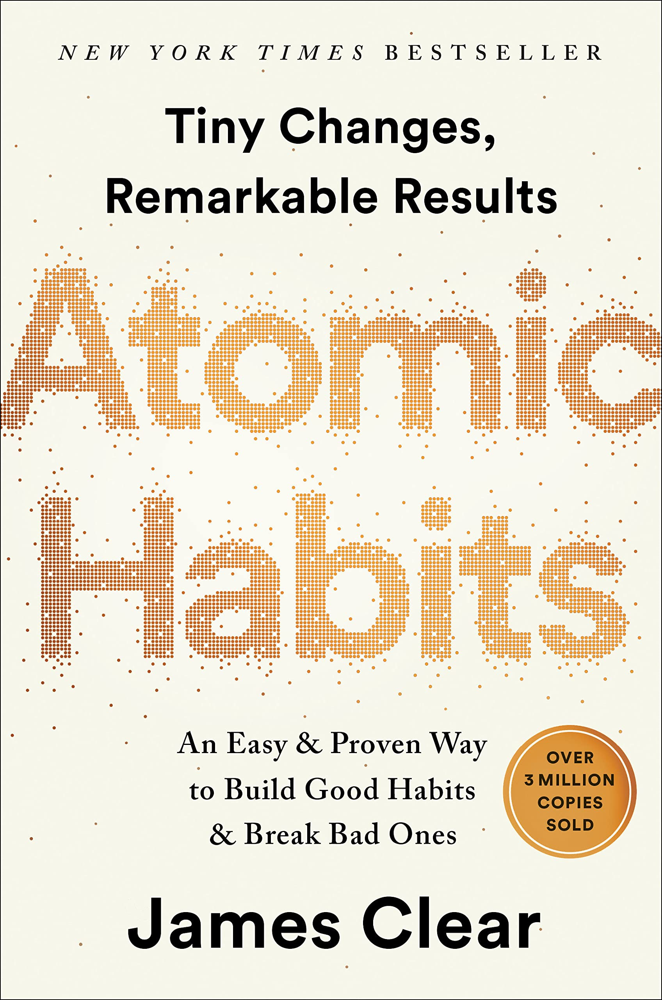

# *Atomic Habits*, James Clear

<!--**TL;DR**

1. Ever since the industrial revolution, humans have become very bad at breathing, which has had huge negative effects on our health.
2. The fundamental changes we need to make are simple: breathe from the nose, exhale deeply, breathe slowly, breathe less, and chew more.
3. The “perfect” breath is 5.5 seconds of inhalation and exhalation with 5.5L of air intake. This breathing pattern is a feature of prayer chants in many religions of the world.

-->

<em>Atomic Habits</em> is a book with a simple but profound message - the impact of small (atomic) habits, done consistently, will compound over time. This message is captured perfectly by the crisp statement on the front cover: “Tiny Changes, Remarkable Results”. The fundamental value of this book is its simple and immediately actionable advice on how to build reliable habits and reinforce positive changes in our lives. 
 

Clear starts by making an important observation - true change must be internally motivated. It is one thing to set an arbitrary goal, e.g. “I want to go to the gym more”, but that goal by itself is not enough. To source durable motivation, there needs to be a fundamental desire at the deepest level of our identity. He gives a great example involving people who want to quit smoking. When offered a cigarette, one simply says “No thanks, I am trying to quit.” while the other responds “No thanks, I am not a smoker”. The distinction is subtle, but it’s clearly there. The second one is a type of vote for the person we want to be - a vote for a new identity. This is the internal motivation that can be the foundation for a long lasting positive change.

 

The shift in mentality is foundational, but it needs to be acted upon. Once we genuinely believe in our new goal, there needs to be an effective <em>system</em> that can help us achieve our objective.  Just as atoms are small but together make up all the matter we see, atomic habits are small habits that together make a systematic pattern of behaviour. The problem with setting one off goals is that they are momentary objectives that limit your scope. Once you’ve jogged 5 miles, now what? Goals box you in. A system/workflow that continually encourages you to run will allow you to long term change even beyond your initial goal. Both winners and losers set goals, but only one of them has an effective system to realise their objectives. Goals without systems to achieve them are useless. As Clear puts it: “You don’t rise to your goals, you fall to the level of your systems”.

 

So how do we cultivate atomic habits? The key is to realise that all habits are the result of the same process:

 

Environmental Cue → Craving for a feeling associated with the cue → Response to realise feeling → Reward from response

 

This basic framework can describe almost all our behaviours. Like many, I have an annoying habit of checking my phone when I get stuck at work. This habit can be broken down as follows:

 

Get stuck at work → Crave a distraction from being stuck → Pull out my phone and check Twitter → Feel fulfilled with the distraction

 

We can exploit this to come up with a framework for making new habits:

 

1. Make the stimulating cue obvious
2. Make the craving/result attractive
3. Make the response easy
4. Make the reward satisfying

To break a habit, we can simply do the opposite

1. Make the stimulating cue invisible
2. Make the craving unattractive
3. Make the response difficult
4. Make the reward unsatisfying

This simple 4 point framework forms the basis for the rest of the rest of the book, which is full of simple advice on how to achieve these steps.

 

The first step is to make the cues associated with our desired habit obvious. Two of the most common cues are time and location. For example, sitting on the couch can induce us to crave watching TV. Because spatiotemporal cues can be so powerful, one simple step is to actively associate the new habit with a precise time and location. Actively tell yourself “I will do X at time Y at location Z”. This is known as an <em>implementation intention</em>. This way, the desired habit goes from a nebulous desire to a concrete plan with concrete details.

 

Another trick is to use <em>habit stacking</em>, where we use existing habits to reinforce new ones. The formula for this is that “After/Before I do habit X, I will do new habit Y”. One example from my own life is doing yoga when I wake up in the morning. Because yoga needs to be done on an empty stomach, I stacked it before breakfast - i.e. I’ll only eat breakfast after I do yoga. Morning yoga has now become a rock solid fixture of my schedule for more than 2 years.

 

Not all cues are spatiotemporal, and sometimes it’s specific features of our environment that can induce behaviours. If we see a chocolate sitting on the table, we are more likely to just eat it than if it wasn’t there. The key with environmental cues is to recognise that we have agency and can <em>design our environment</em> to engineer what cues we can and cannot sense. If you want to read before going to bed, just put a book on your pillow so that it’s waiting for you when it's bedtime. Eventually, you’ll just come to associate reading with going to bed, and start doing it naturally. Similarly, if there are cues that induce bad habits, try to remove them. If you watch too much TV, remove it from your bedroom. If it’s really bad, unplug it and put it into the closet once you’ve watched whatever show you said you’d watch. By engineering our environment, we can make the good stimuli obvious, and the bad stimuli invisible.

 

Once we’ve identified our cue, we have to make the craving it induces attractive. <em>Temptation bundling</em>, where you pair something you want to do with something you need to do, is a very effective trick to help with this. If you check your social media too much, tell yourself that you can check your phone after you do 10 push ups. This way, there is a concrete positive reward that you can anticipate. Clear talks a bit about how research shows that anticipation of a reward is often as powerful as getting the reward in boosting motivation. Another easy thing is to create a <em>motivation ritual</em>, a small easy act that you enjoy before a difficult habit. Through the ritual, you can begin to associate the positive ritual with the difficult habit, helping build motivation.

 

Humans are fundamentally social creatures with a deep desire to belong. We can exploit this to make almost any habit look attractive. For example, if all your friends at work go to the gym together everyday, you are more likely to want to join them to fit in. We tend to absorb many of the habits of the people we surround ourselves with naturally in an attempt to fit in. Exploiting this deep desire for belonging is incredibly powerful, but it can be a two-sided sword. If your friends and family are all smokers, it is more likely that you smoke. The people you surround yourself with are incredibly influential on you - choose them wisely!

 

The next step is to make your desired activity very easy to do. We physicists and chemists have a concept of <a href="https://en.wikipedia.org/wiki/Activation_energy">activation energy</a>, which is the amount of energy required to make a reaction take place. Reactions with low activation energy happen easily. There’s a straightforward isomorphism to Clear’s third law of habits - “Make it Easy” becomes “reduce the energy required to make your habits happen”.  To get rid of bad habits, make them require too much energy. Humans are <em>fundamentally lazy</em> and will naturally do the easiest thing - take advantage of that!

 

There are many ways to do this. The environment engineering we discussed before will also help here. If the book is already on your bed and you don’t have to spend extra effort remembering to get it from the bookshelf, then it becomes easier to read. There are plenty of one time choices in our environment that can automate a lot of processes and deliver outsized long-term impact. If you want to build a habit of paying your credit cards on time, do the work of setting up autopay once so you can forget about it later. Similarly, if there is a bad habit, make it harder to do. If you spend too much time looking at your phone while working, put it in another room or give it to a friend. I personally have tried this and to my surprise my laziness is able to keep me working even when I hit a stumbling block.

 

One cute method to get started with a habit is the “Two-Minute Rule”, where you downscale your desired habit until it can be done in two minutes or less. Want to read more? Start by reading a couple of pages nightly. By reducing the scope to the smallest possible size, you can build momentum and work your way up.

 

Finally, you can use external mechanisms to change the activation energy of your habits. A good example is using technology to lock in future behaviour. For instance, I recently downloaded an app just to remind me to drink 250 mL of water every hour. That makes it much easier than consciously having to remember to drink/tracking how much water I drank. “Commitment devices” are another example, where you make a choice now that restricts you in the future. This way, you in the present acts as an external check on you in the future. In one of his many anecdotes, Clear tells us how in 1830 the French writer Victor Hugo wasted too much time and now had only 6 months to write a new book for his publisher. Faced with the deadline, Hugo told his assistant to lock all his clothes away. With nothing except the most basic of clothes left, Hugo couldn’t go out or entertain guests at home, so he was forced to work. Thanks to this, his book, <em>The Hunchback of Notre Dame</em>  , was published two weeks early.

 

The previous steps only make it possible to do the habit once. To finish the loop and repeat it, we need to make it satisfying. The most obvious way to do this is to give yourself an immediate reward. If you achieve your reading goal, maybe treat yourself with a small chocolate. Of course, your rewards need to be intelligently chosen. If your habit is to exercise then a chocolate reward isn’t so smart. Your habit is a vote for one type of identity and the reward is for an opposite type of identity. Over time, the reward can cancel out the habit if not chosen properly.

 

A simple reward you can use is to just track your progress, since the feeling of progress is itself very satisfying. This could range from tracking your weight to something as simple as noting how many days in a row you do a habit. The latter can be quite powerful, especially when we consider the importance of being consistent. I have done this personally with my daily language practice on Duolingo, which has become much more reliable since Duolingo started tracking streaks. My current streak is at 1213 days, and without this, I would have definitely not practiced as consistently as I do now.

 

However, be careful to avoid <a href="https://en.wikipedia.org/wiki/Goodhart%27s_law">Goodhart’s Law</a>, which says that “when a measure becomes a target it ceases to become a good measure”. With my Duolingo example, I know that on some days when I’m lazy I practice units I’m already good at. That advances my streak, but it doesn’t necessarily help in the real objective of building my language skills.

 

To make a bad habit unsatisfying, we can use an accountability partner. Since humans are social creatures and care a lot about what others think, not wanting to disappoint your partner can be a powerful source of motivation. If that isn’t enough, you can take it to the next level by making formal “contracts” with your partners. Clear tells us about Bryan Harris, an entrepreneur from Nashville who wrote an actual contract outlining his weight loss goals. The penal mechanisms if he failed to reach his objectives included giving his personal trainer and wife money as a sort of fine. The contract was even formally signed to give the veneer of a fully official contract. Because of this, Harris avoided eating unhealthy food and achievde his objectives. This accountability paradigm can also be extended with technology. Thomas Frank from Colorado wakes up at 5:55 AM, and if he doesn’t, he has an automatically scheduled tweet which says “It’s 6:10 and I’m not up because I’m lazy! Reply to this for $5 via PayPal (limit 5). Assuming my alarm didn’t malfunction”. This hilarious public consequence of failure is also a powerful motivator.

 

The final section of Clear’s book goes over “advanced tactics”, to help us go from good to great. First he touches on the role of genetics, which determines a lot of our behaviour. If we try to cultivate habits in areas we are naturally talented in, we are more likely to achieve greatness. He is quick to point out that we should not see this as genetics cruelly predetermining our fate, but rather as allowing genetics to show us the areas of high opportunity for us. This point resonated with me. I love basketball and have played it for a very long time. I was captain of my high school team but I know that I stood no chance of playing on any college team. After playing with those level of players, in pickup games I can see that they are fundamentally just better athletes than me and really no matter how hard I try my upper limit is far below theirs. It’s ok though because I think I’m more predisposed to science and writing, which is where I’m trying to focus on! There is no reason for us to feel constrained by others’ expectations - we should do what we enjoy the most. As Clear says, good players learn to play the game while great players make their own games.

 

Finally, Clear leaves us with a thoughtful chapter which contemplates the downsides of becoming good at forming habits. The essence of habits is that they automate away a lot of our behaviour, which can make us oblivious to errors/improvements we can make. He recommends actively reflecting and reviewing your progress to be attentive to your performance and see if you are achieving what you truly want to achieve. Habits are implicit votes for beliefs in your identity, and sometimes your beliefs can prevent you from growing. The key to this is to be flexible and able to redefine yourself as the circumstances dictate. Imagine you are a soldier whose identity was “I am a great soldier” but had to retire - what do you believe in now? Many veterans struggle with this question. If you allow continuous redefinition, “I’m a great soldier” can become “I am a person who is disciplined, reliable, and a team player”. The danger of habits is that they can lock you into static ways of thinking in a dynamic world. Reflection, review, and the ability to redefine yourself are the key to avoiding this.

 

<em>Atomic Habits</em> is an excellent book. Full of simple and actionable advice, it provides a blueprint to get started improving your life immediately. Although I feel I knew a few of the points of Clear’s habit building framework, such as environment design and habit stacking, his fuller framework formalised what I already knew and taught me more tactics to try to improve myself. His crisp, clear writing style and wonderful chapter summaries make the book very easy to read, and the tables at the end of each chapter are very helpful in tracking the various steps of forming new habits. If you are looking for a simple book that can help you make changes from the moment you open it, you should read <em>Atomic Habits</em>.

 
