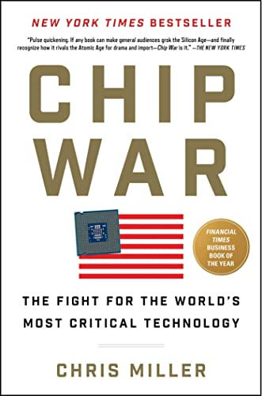

# *Breath*, James Nestor

Chip War is a masterful history of semiconductors and integrated circuits, the technology that underpins virtually all of society today from computers to cars and from microwaves to missiles.  Miller’s book paints a vivid and wonderfully accessible picture of how these chips, initially conceived in esoteric physics laboratories, evolved into the half a trillion dollar industry that today commands the most sophisticated global supply chains and forms the basis of today’s intense technological competition between the US and China.

 

## The Origins of Chips 

The book begins with the humble origins of chips in the labs of people such as William Shockley, Walter Brattain, and John Bardeen. Chip War is notable in that although Miller’s book is intended for a general audience, he does not shy away from explaining the scientific details as and when they emerge along the story of semiconductors. For instance he offers a concise explanation of semiconductors right at the beginning of chapter 2 which no physicist could find fault with. Later on, as chips balloon into incredibly complex devices requiring numerous specialised manufacturing steps and hundreds of thousands of custom made cutting edge machines, Miller still finds a way to explain how the relevant technology/processes work without getting lost in the weeds. For instance, readers will also learn about photolithography, where light is used to “print” patterns on semiconductor wafers, the difference between NAND and DRAM chips, and the intensive capital requirements for setting up chip foundries. Miller is able to explain these technical concepts in an engaging way that keeps the reader interested. 

 

One great feature of Chip War is how Miller focuses not just on what happened, but who was responsible for it. Throughout the book we learn about the genius leaps made by a whole host of key characters that played vital roles in advancing innovation. This includes not only physicists like Shockley, Brattain, and Bardeen, but also engineers like Bob Noyce and Jack Kilby, who had the incredible idea to assemble multiple components on the same piece of semiconductor, leading to the integrated circuit. 

 

## The Role of Markets

Crucially, and most interestingly for me, Miller also highlights all the entrepreneurs and managers who were so critical to building the chip industry from the ground up. Examples include Jack Simplot, an Idaho potato farmer who provided startup capital to Micron Technology which would become one of the largest companies in the DRAM market, and Charlie Sporck, a hard nosed manager who specialised in “wringing productivity out of workers and machines alike” and helped Fairchild semiconductor compete on the brutal semiconductor markets during the 1960s. By exploring the roles of both the scientific and entrepreneurial heroes of this story, Miller also drives home the point that technological progress requires both scientific innovation and commercialisation to spread innovation. 

 

In fact, one of the key learnings of this book for me is just how important financial incentives are in innovation. We learn how Fairchild’s belief that giving equity to employees was “socialism” caused all of its talent to leave. As Miller writes “alongside new scientific discoveries and new manufacturing processes, the ability to make a financial killing was the fundamental force” behind innovation in chips. Very appropriately, the chapter in which he says this is titled “I … WANT … TO … GET … RICH.” after what a Fairchild employee put on their exit survey. Once upon a time I would have scoffed at such brazen self interest, but over time I’ve learned that markets are critical to spreading innovation. Reading about the chip industry offers yet another forceful reminder of the power of science and markets acting in unison.

 

## Chips in the US-USSR Rivalry

In addition to the scientific and commercial aspects of the chip industry, Miller also explores its tremendous strategic importance. Right from the very start, government contracts were critical in nurturing the chip industry until commercial markets could be formed around them. In 1958, the Soviets launched Sputnik which prompted a “crisis of confidence” in the US and led Washington to launch a “crash program to catch up with the Soviets’ rocket and missile programs”. The US aimed to use the computing power of chips to enhance the precision of their weapons. In this way, rockets such as the Minuteman-II became the first major market for integrated circuits. Chips were also essential for the Apollo program. Sales to Apollo alone transformed Fairchild’s revenues from $500,000 in 1958 to $21 million in 1960. Crucially, as production ramped up for NASA, economies of scale allowed Fairchild to slash prices. An integrated circuit that sold for $120 in December 1961 sold for $15 next October. This reduction in prices, and NASA’s stamp of approval, allowed chips to become far more widespread. The example of the Apollo program was particularly instructive for me as it was a vivid illustration of what happens when science, market, and government can do when they act in alignment. 

 

Naturally the Soviets responded to Apollo and advanced American rocketry by trying to steal/reverse engineer American chip technology. Here, I was surprised by how uninspired and defeatist the Soviet strategy was. Rather than attempting to learn about the scientific principles behind chips and create their own technology, the Soviet policy was simply to copy the latest American design they could get their hands on. Not only did this simplistic policy severely underutilise the genuine world class scientific talent the USSR had, but it was also doomed from the outset. As Miller explains, copying was fine for nuclear weapons, of which only a few thousand were produced during the entire Cold War and whose technology changed on timescales of years. Chips on the other hand were produced in much much larger numbers and the technology evolved far more rapidly. By the time the Soviets had copied the latest design, US firms like Fairchild or Texas Instruments had already made more powerful chips packed with more transistors. In contrast to the American chip industry, which was driven by the potent combination of government intervention and market incentives, the Soviets’ unimaginative top-down copy it approach meant they were “doomed to backwardness”. The fact that the Soviet chip industry just allowed itself to not compete with the Americans meant that the USSR never posed any significant threat to the US chip industry. 

 

## Global Supply Chains and The Japanese Challenge

Ironically, a far more potent threat came from those American allies who the US had enthusiastically integrated into its complex semiconductor supply chains. Throughout the 1960s and 70s, American firms had aggressively expanded operations in locations like Japan, Korea, Hong Kong and Singapore due to lower costs. Over time, countries like Japan developed their own indigenous chip manufacturers who began to encroach aggressively on American firms’ market share in the 1980s. At first US firms like Intel and TI didn’t take the Japanese too seriously. They “joked that Japan was the country of “click, click "", mocking the sounds of the cameras that Japanese engineers used to copy ideas at chip conferences. However they failed to notice that Japanese chips were of better quality than American ones. Richard Anderson, an HP executive tasked with determining which chips met HP’s requirements discovered that no Japanese firm reported chip failure rates above 0.02% over the first thousand hours of use. By contrast 0.09% of American firms’ chips malfunctioned. Given that Japanese chips worked the same as American ones and malfunctioned far less, it was clear that many customers would switch their business. 

 

Competition from Japan was far more intense than anything the Soviets were able to do. Thanks to efficient manufacturing processes and an abundance of government support, by 1986 the Japanese produced more chips than America. By the end of the 1980s, “Japan was supplying 70 percent of the world’s lithography equipment”. Although the Japanese challenge started in specific categories such as DRAM chips, it had now expanded across the full scale of the industry. The Japanese threat was so intense that it caused Bob Noyce to wonder “whether Silicon Valley would end up like Detroit”. 

 

On the other end of the Pacific, Japanese self confidence was growing exponentially. Japan’s growing economic heft led Sony’s founder Akio Morita to publish a collection of essays titled A Japan That Can Say No: Why Japan Will Be First Among Equals. These essays were filled with critiques of American business practices and had chapter titles like “America, You Had Better Give Up Certain Arrogance”. These essays called for Japan to break free from an “overbearing America that had bossed Japan around for too long”. Beyond the bluster, such sentiment provoked genuine panic in Washington because Americans were acutely aware that Japanese chip dominance gave it a genuine way to coerce America. 

 

## American Resurgence

This inter-ally strategic contest took another turn in the 1990s, when the Americans came roaring back thanks to their traditional strong suit: innovation. Companies such as Micron (backed by the aforementioned Simplot) challenged Japanese rivals head to head in DRAMs. For instance, while many firms focused on making the transistors on chips smaller, Micron aimed to shrink the entire chips themselves. This would let them make more chips from the same silicon wafer which made manufacturing more efficient. Through many cost cutting innovations like this, Micron outcompeted its Japanese rivals. Intel meanwhile “relentlessly copied Japanese manufacturing methods” and changed its entire culture to function “less like a research lab and more like a finely tuned machine”. Intel CEO Andy Grove also made the key decision to pivot away from the DRAM chips it had dominated for so long to the newer market for PC chips. This wholesale restructuring was a bold and typically Silicon Valley gambit by the company to “disrupt” itself. 

 

A fearsome illustration of American ingenuity was on display during the First Gulf War, where US stealth bombers used state of the art laser guided Paveway bombs to precisely target and destroy key objectives. Very quickly, thousands of precision munitions were decimating the Iraqi army. These weapons were only possible because of integrated circuits, and the US was the only country that had been able to integrate chips so extensively into its military technology. As a result, the Gulf War showed that the nature of war was changing. Air-to-air missiles used in Vietnam became six times more accurate in the Gulf War, thanks to their semiconductor upgrades. The Japanese did not have an army to speak of, so they obviously couldn’t compete with this. America’s superpower rival, the USSR, also became “nervous about its air defense capabilities” in the face of such precision destruction. 

 

Complementing the creative destruction at home (and not so creative destruction abroad) was the decision to encourage the creation of a chip industry in South Korea to rival that of Japan’s. Executives like Grove reasoned that if the Koreans became competitive DRAM manufacturers, they would undercut Japanese firms and break their monopoly. The Koreans were enthusiastic to pursue this. Lee Byung-Chul, the founder of Samsung, was eager to break into the semiconductor industry. The South Korean government also signaled its support with a promise to invest $400 million to develop semiconductors. As in Japan, government directives in Korea encouraged banks to lend at favourable rates to the budding industry. Meanwhile the US provided a market for Korean DRAM chips and also enthusiastically transferred technology as most of Silicon Valley’s DRAM firms were near collapse anyway. The Americans were happy to support the Koreans as long as it undercut the Japanese. As Jerry Sanders, the CEO of AMD, put it: “my enemy’s enemy is my friend”. 

 

Meanwhile, the start of the 1990s were a disastrous time for Japan. The bursting of the Japanese asset price bubble led to a deep recession. The semiconductor industry began to be seen as a case study of what went wrong in the Japanese model: government overinvestment. Easy money from the state distorted normal competition and kept many Japanese firms alive even after they began to be outcompeted by Micron and Samsung. In contrast, the lack of government subsidies on a similar scale meant that American firms had to be profitable and thus continually innovate. Japanese firms on the other hand, with the exception of Sony, failed to use their dominant market position to innovate. Fujio Masuoka, a mid-ranking manager for Toshiba, invented a new chip in 1981 that could continue “remembering” data even when it went off. Toshiba simply ignored this, and ultimately it was Intel that brought this chip – now known as the NAND chip – to market. Japanese firms also totally missed the PC revolution, ceding all those gains to companies like Intel that were forced to make the pivot in search of profits. This, coupled with intense competition from South Korea, meant that Japan’s market share of DRAM chips went from 90% in the late 1980s to 20% by 1998. For me the main lesson from the Japanese story was that government action must be paired with and eventually give way to market incentives.

 

## Global Chip Chokepoints: TSMC and ASML

So far, the history of the chip industry has failed to mention what is today maybe the most important country in its supply chains: Taiwan. Taiwan’s central role began in 1985 when government minister K. T. Li contacted Morris Chang. Born in Taiwan but educated at MIT and Stanford, Chang had helped build Texas Instruments into one of the biggest semiconductor companies. Li asked Chang to build a semiconductor industry in Taiwan, asking him to “Tell me…how much money you need”. Much like in Japan and Korea, enthusiastic government support was essential to building such a capital intensive industry. This government money was also backed by private investment raised from wealthy Taiwanese, sometimes with a little ‘cajoling’ from the state. Miller describes how when one businessman declined to invest after meeting Chang three times, he received a call from Taiwan’s prime minister reminding him that he ought to reciprocate the governmental largesse displayed to him or else. 

 

The company that Chang created, Taiwan Semiconductor Manufacturing Corporation (TSMC) eventually grew to become one of the most central nodes in the global supply chain. A huge reason behind TSMC’s success was its pioneering of the foundry model. Instead of designing and making its chips in house, TSMC opted to focus exclusively on chip manufacture for other companies like Apple, Qualcomm, and Nvidia. Because of this focus, TSMC’s manufacturing processes became the most efficient and indispensable to dozens of the largest companies. In contrast to TSMC’s foundry model, “the old model of integrating design and manufacture would struggle…when the rest of the industry was coalescing around TSMC”. 

 

Another critical node in the chip supply chain is in the Netherlands because the Dutch company ASML is the only manufacturer of the most cutting edge extreme ultraviolet (EUV) lithography systems. EUV systems are important because extreme ultraviolet light is needed to create the smallest and most modern chips. However, ASML didn’t “invent” the EUV machine. Much like the broader chip industry, EUV was an innovation built on a foundation of many smaller innovations. For instance companies such as Cymer and Trumpf were crucial in inventing the necessary laser technology, while Zeiss had to create mirrors “that were the smoothest objects ever made” in order to refract the EUV light. ASML’s key role and expertise was to successfully “orchestrate [this] far-flung network of optics experts, software designers, laser companies, and many others” whose inputs are crucial to EUV machines. 

 

## A Chinese Chip Industry?

Having painted a thorough and deep portrait of the history of chips and their supply chains, Chip War ends with a look at the role of chips in the current US-China rivalry. Much like the US was afraid of the geopolitical leverage Japan’s chip dominance would have, China today is afraid of the same thing. Xi Jinping declared in 2016 that “However great its size…if an internet enterprise critically relies on the outside world for core components, the ‘vital gate’ of the supply chain is grasped in the hands of others”. Given this, building a high tech domestic chip industry has now become an explicit state goal of China.

 

Following the Japanese, Korean, and Taiwanese blueprint, the Chinese project of building a semiconductor industry has received extensive state support. In 2014, Beijing augmented its hefty semiconductor subsidies with the “Big Fund” – a state run pseudo-venture fund to back the next generation of chip companies. All together, it's believed that China has easily put tens of billions of dollars into domestic chip companies like the Semiconductor Manufacturing International Corportation (SMIC). 

 

Another aspect of China’s semiconductor strategy has been to use access to its vast internal market as a bargaining chip to access technology transfer. Even though I thought that this was a very clever strategy, I was a bit surprised that big names like IBM and AMD had engaged in such deals. There wasn’t anything illegal about these deals – Miller notes that “Viewed on their own terms, the deals … struck in China were driven by reasonable business logic”. It makes sense given that no firm can resist access to such a vast market. But the fact that multiple chip companies were lured simultaneously means that the potential for technology transfer across the entire value chain becomes a real possibility. If the Chinese pull this off, I think it’s quite smart. Although to their credit the Americans have implemented numerous changes since this book was released (such as Biden’s decision to ban firms like Nvidia doing business with China) so this strategy is unlikely to keep working as well. 

 

Without a doubt the most successful Chinese tech company has been Huawei. It was quite interesting to see the parallels between the rise of Huawei and Samsung. Like Lee Byung-Chul, Huawei founder Ren Zhengfei began by “assiduously cultivat[ing] political relationships to garner favorable regulation and cheap capital”. Then, Huawei identified products from the West and Japan that it could build at equivalent quality but lower cost. Finally like Samsung, Huawei globalised relentlessly and did not shy away from international competition. In this, Huawei has diverged from other Chinese giants like Alibaba and Tencent who mostly operate in China’s vast domestic market. Huawei’s decision to compete has been a successful one, helping the company win major market share internationally. Eventually, Huawei ascended the value chain right to designing some of the world’s most complex chips, threatening America’s monopoly on chip design and positioning itself well to capitalise on future trends like 5G. 

 

## Chips and The US-China Rivalry

The final section of the book, titled “Chip Choke”, goes into the details of what the US-China chip competition will look like. The US government has become increasingly worried that if “Left to the whim of their shareholders and to market forces, chip firms would slowly transfer staff, technology, and intellectual property to China until Silicon Valley was hollowed out”. This change in attitude, particularly since the Trump administration, has led to a much closer governmental scrutiny of the chip industry. 

 

Spying and intellectual property theft is also an effective way to pursue technology transfer, and many Chinese firms have been very active in this. Chapter 50 explores this, using the example of its namesake: Fujian Jinhua. Fujian Jinhua is a state owned DRAM manufacturer in China which stole technology from Micron in the US. I found it very funny that this high tech technological theft was carried out by simply copying files and uploading them to Google Drive. When Micron sued Jinhua, Jinhua countersued in Fujian, where the local court ruled against Micron (surprise!) and banned it from selling 26 products in China, which is its biggest market. Although this is clearly unfair, given the zero-sum nature of geopolitics and the fact that morality carries near zero weight in great power competition, I think this was a very smart f*** you manoeuvre. Morality didn’t prevent Europe from plundering Asia, so I don’t really care too much that an Asian country used its own economic heft to “unfairly” target someone else. It’s just what great powers do. 

 

Speaking of great powers, in response America has upped the ante by targeting Huawei on multiple fronts. The main concern wasn’t that Huawei was directly supporting the Chinese military but that the company was “advancing China’s overall level of chip design and microelectronics know-how”. I understand why this is a threat to the US, but part of me feels somewhat incensed that a country should simply just not be allowed to advance its knowledge in a particular field. Nevertheless as I just wrote, morality is meaningless in geopolitics and we must deal with the world as it is and not how we would like it to be. In May 2020, the Commerce Department put new restrictions on sales to Huawei, which made it very difficult for the company to use US technology to design new chips. TSMC is also not allowed to use US produced technology to make chips for Huawei. Even SMIC also relies extensively on US tools. The only chips that Huawei had access to were those which the US Commerce Department gave it a special license for. Even after the publishing of this book, the US hasn’t eased up. Just recently Biden imposed new restrictions on Americans working with Chinese chip companies and also convinced ASML to not sell EUV machines to China. This is the literal manifestation of the Chip Choke in action. 

 

The central position of TSMC in the global chip supply chain has also become somewhat of a poisoned chalice for Taiwan in light of the intensified US-China rivalry. The new US restrictions, which have severely restricted China’s domestic chip industry, have made apparent the huge dependence China has on TSMC. This, coupled with China’s long standing stated aim to reunify with Taiwan, has appeared to elevate the risk of conflict in the Taiwan strait. If a crisis in Taiwan knocks out all of its fabs, the “total costs would be measured in the trillions” – not to mention the devastation if actual war were to break out. Given this precarious position, the US has attempted to coax TSMC to build fabs in America and other friendly nations but the immense capital expenditure required to make fabs means this will be a very costly and long term process. There have been crises over Taiwan before, for instance in 1958 when Mao decided to barrage Taiwanese islands with artillery. Those crises were diffused because of the immense asymmetry in US and Chinese military power, but this asymmetry is rapidly narrowing. Given this trend, and the chip choke put on China, we should be prepared for a potential crisis over Taiwan. 

 

Chip War is definitely one of the best books I’ve read because I learned so much from it – the much longer than intended length of this review is testament to that. This book was extra special for me because it helped me see how a technology can progress from esoteric to commanding a market worth hundreds of billions of dollars. Chip War cemented my view that the combination of science and markets, sprinkled with the right amount of government support, is the engine of technological progress. Science produces innovation, and markets spread its benefits to the masses. Eventually, the technology can become so ubiquitous that it has geopolitical impact. Semiconductors did all of this, and maybe the stuff we work on in our lab might also be commercialised some day. I’m not sure, but I know that this book has certainly made me change my mind to consider that possibility more seriously and not just dismiss that as a silly get rich fantasy. Chris Miller does an absolutely wonderful job telling the story of how the semiconductor revolution happened, weaving science, market, and geopolitics – including all the gritty details – into an incredibly engaging book. Chip War is an absolute tour de force and I wholeheartedly recommend it for anyone interested in how today’s world was created and what the future might hold.

 
