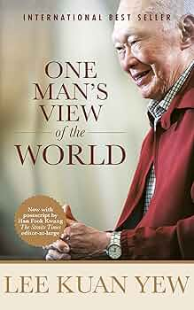

# *One Man's View of the World*, Lee Kuan Yew

Lee Kuan Yew is one of the giants of history and a personal role model, so naturally I could not resist picking up this book on my layover at Changi airport in Singapore. Written in the early 2010s, this is the latest book with LKY’s insights on the changing global order, and therefore the most relevant today. 

 

The book is split into different themes. The first few chapters are concerned with the countries LKY believes to be the most important for the next century. It starts with a chapter each on China, the US, Europe. On China, the dominant theme is accepting its incredible rise and identifying key challenges it will face such as demographics and difficulties establishing the rule of law. For example, he notes that the Chinese are not as innovative as the Americans partly because there are less robust IP protections. Nevertheless he sees that within 20-30 years China will be a peer competitor to the US. Given that he was writing 10 years ago, this prediction appears on track in 2025.

 

Regarding the US, he believes it is troubled but retains faith in its dynamism. He is alarmed about the federal deficit, but is convinced in America’s ability to reinvent itself. Key to his belief is America’s ability to attract the best and brightest from all over the world. Despite his wisdom, I doubt even he could have foreseen the drastic change of government in the US since he died. On Europe, he is very dismal. He notes that Europe is mired in welfare and uncompetitiveness. The European Union in its present form is an impediment because it is a monetary union without a fiscal one. His solution is either a full United States of Europe or an end to this fake confederation. This chapter was personally quite vindicating for me as I have shared exactly these views too.

 

Then he deals with Japan, Korea, and India. He identifies population collapse as the key challenge for both Japan and Korea, which has only worsened since his passing. On India he expresses profound disappointment. To LKY, India is a potential giant held down by the baggage of caste and excessive diversity. I agree on the former but I do not on the latter. He thinks India is an artificial country joined by a British railway which is wrong. India is a civilisational state like China, but it is a civilisation that has diversity and plurality at its core. I have faith that India will make something decent of itself. Today it is the fastest growing economy in the world, so maybe he was a little wrong on that count. 

 

He wraps up the world tour section of his book with a jaunt around his own neighbourhood in Southeast Asia and the Middle East. One interesting moment for me in these sections was how he noted the biggest change in modern Indonesia was the devolution of powers to its states in the early 2000s. This is a pretty lowkey unremarkable seeming event but identifying it is emblematic of LKY’s insight, especially into his own region. On the Middle East he simply notes that the Arab Spring was a failure and that Western style democracy doesn’t really have a place in the Middle East, which has definitely proved true in the decade since his passing. 

 

He wraps up the world tour section of his book with a jaunt around his own neighbourhood in Southeast Asia and the Middle East. One interesting moment for me in these sections was how he noted the biggest change in modern Indonesia was the devolution of powers to its states in the early 2000s. This is a pretty lowkey unremarkable seeming event but identifying it is emblematic of LKY’s insight, especially into his own region. On the Middle East he simply notes that the Arab Spring was a failure and that Western style democracy doesn’t really have a place in the Middle East, which has definitely proved true in the decade since his passing. 

 

I found the chapter on his personal life quite touching. He spends much of it contemplating the end of his life and how he is preparing for it. This type of humility from a true giant really moved me. I loved how he mentioned that he can get up and walk without support at the age of 89 due to his daily little workouts. I certainly hope I am like that! He ends by saying that his greatest satisfaction in life comes from “making this place [Singapore] meritocratic, corruption-free and equal for all races - and that it will endure beyond me, as it has.” I really admire that he built something magnificent that could survive without him as the past decade has shown. 

 

One final note is that this book is written in typical Lee Kuan Yew style – that is to say with very little regard to political correctness. He is honest and very frank. For example when he is asked about China becoming democratic, he very frankly argues that democracy hasn’t worked so well in India. At another point he flat out refuses Europe as a model for Southeast Asia. None of this is out of a desire to be provocative. He is just being honest and when pressed he’s able to present valid reasons. Normally when a person talks about the world with such definiteness I’m inclined to discount their opinions since the world is complex and most claims require some error bars, but Lee’s vast experience means he can get away with it. One day I hope I’ve also done enough in my life that I can speak this frankly and without self-doubt. 

 
