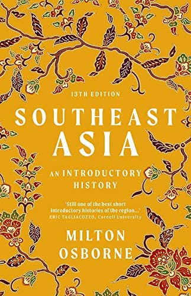

# *Southeast Asia An Introductory History*, Milton Osborne

<em>Southeast Asia: An Introductory History</em> is a book that does exactly what it says on the cover. This book, by Australian historian Milton Osborne, is a great introduction to the history of an incredibly diverse corner of the world. Starting from roughly ~1000 AD and running right up to the modern era, Osborne’s history provides a gentle guide to how the various peoples, societies, and states of Southeast Asia evolved over the past millennium. 

 

Osborne begins by setting the “classical background” of Southeast Asian history. This he defines as roughly the first few centuries of the past millennium. The first major kingdoms we learn about are the Angkorian and Srivijaya empire. The Angkorian state, which existed in what is today Cambodia, began to emerge from the ninth century onwards. The Angkorians were notable most for their architecture, of which Angkor Wat is the most famous example, and for their “mastery of water” through “sophisticated … hydraulic engineering” which led to massive rice crops. Srivijaya was a trading empire that rose to power in the sixth and seventh centuries CE due to its key position among trade routes between India and China. 

 

One of the key themes of this classical period is the influence of Indian traditions on the region, what Osborne calls “Indianisation”. For example, we see that in most Southeast Asian kingdoms during this period, “the rulers and their courts were followers of imported religions, of Hinduism and Buddhism”. The cultural impact of Sanskrit and Indic literature like the Ramayana is still visible all across the region even today in countries like Malaysia, Indonesia, and Thailand. Osborne suggests that one reason for the attractiveness of Indian ideas for Southeast Asian rulers would be that Indian culture provided “an organised … doctrine” for individuals ready to grasp at “greater religious and secular power”. That is, Indic ideas gave enterprising individuals a means by which to organise societies under their leadership, which is an idea I found intriguing.

 

Indianisation didn’t extend to the whole region though. Vietnam, for instance, was dominated by Chinese influence as reflected by its Confucian societal configuration. Other places, like the Philippines, were simply too far for Indian influences to reach. 

 

China usually viewed Southeast Asia, or Nanyang, as “lacking in discipline and order” and thus incompatible with Confucian values. In Chinese eyes such a region could only exist as in a “proper tributary relationship with China”. Osborne is careful to clarify what tributary means in this context, observing that this was a relationship of give and take. In exchange for not acting contrary to Chinese interests, the tributary would get favourable treatment from China. Srivijaya, for example, gained the right to trade with China in exchange for tributary status, which gave it a huge advantage over other rival trading states. 

 

The organisation of Southeast Asian states also differed considerably throughout the region. In Vietnam, the Confucian influence was clear as officials advised a ruler whose role was to “mediate between the physical world and the spiritual world by the correct observance of state and religious ceremonies”. The Vietnamese state had a well defined hierarchy with the ruler at the top backed by an extensive organisation of bureaucrats down to the provincial level. Laws were clearly written and explicitly delineated the authority of all levels of officials. Unlike their Indic influenced contemporaries, the Vietnamese also prioritised maintaining clearly defined borders. 

 

In the more Indianised states, “the pattern of official relationships was … much more complex” because “it lacked … clearly defined lines of authority”. Unlike in the Vietnamese system, provincial governors in other states weren’t bound by strict legal codes and could exercise “almost completely unfettered power”. In contrast to the Vietnamese pyramid power structure, the Buddhist kingdoms were characterised more by a series of concentric circles. The outermost circle represents the state and the innermost a usually semi-divine ruler. It was only in this innermost that the king’s power was absolute and it declined the further one went from the capital. This more decentralised structure allowed many power centres to emerge.

 

There was also a sharp divide between the ruler and ruled in this classical world. In virtually all Southeast Asian states, the distinction between the elites and the peasants was one that could “only be bridged in extraordinary times by an extraordinary man”. This division was more solid in the Buddhist states where power resided in informal networks of power centres. In Vietnamese society with its Confucian style examinations, merit could technically enable a peasant child to move into the ruling class. 

 

This traditional order continued more or less until the 19th century, when the arrival of European powers completely changed the nature of societies in Southeast Asia. Although the diverse peoples of the regions were conquered by various colonial powers, one constant throughout the region was the total dominance of European interests over those of the native populations. The success of the Western advance across the region also cast doubt in the old traditions and systems which had been so rapidly uprooted by foreign powers. Beyond this, Osborne is clear that the colonial experience was far from uniform across the region. To make this clear, he often breaks chapters into subsections that detail the experiences of particular countries. Although this is a bit mechanical, I thought it was a very helpful technique to keep the book organised and present the varied range of experiences throughout this diverse region. 

 

One transformation that gets special attention in the book is of the “massive economic change”during the colonial era. Traditional Southeast Asia was essentially agricultural in nature, but the arrival of industrial colonial powers forced a rapid reorientation towards becoming resource engines to supply European industry. For example, although the existence of rubber in the region had been known for centuries, after the arrival of the Europeans vast areas of Malaysia, Indonesia, Vietnam, and Cambodia were brought under systematic rubber cultivation. The Malay peninsula had no rubber plantations before the 1880s, but by the beginning of the 1970s rubber plantations accounted for nearly 65% of all cultivated land. 

 

Malaysia also became a big supplier of tin where the British colonial administration enabled the expansion of existing Chinese tin-mining companies. Chinese dominance was eventually challenged by the greater technological efficiency of Western firms. At all times though tin mining remained dominated by either the British or the Chinese, who were outsiders from the Malay perspective. 

 

The final example of economic transformation given is the changes in rice cultivation. Rice was (and remains) a fundamental component of Southeast Asian cuisine but colonial systems encouraged “the rapid expansion of those of Southeast Asia’s rice-growing areas that were capable of developing rice surpluses” through modern agricultural technology. The main areas were the Mekong river delta in Vietnam, the Chao Phraya delta in Thailand, and the Irrawaddy river delta in Burma. Of these, only Thailand was never colonised so while rice farming intensified, it never devastated local peasants to the extent it did in the other two countries. Without direct external influence, the Thai were better able to manage the interests of economic development with those of peasant smallholders. 

 

A small but nontrivial factor during the colonial era was the presence of Chinese and Indian immigrants in the region, whom Osborne dubs “The Asian immigrants in Southeast Asia”. Chinese minorities throughout the region typically exercised outsize economic influence, as in the case of Malay tin mining although that doesn’t mean Chinese didn’t also engage in low wage demanding work such as physical labour. The Chinese were able to take advantage of the fact that Southeast Asians generally “did not regard commercial endeavour as an attractive way of life”. In an age of increasing capitalist influence on their societies, commercial endeavour became ever more important and thus commercially savvy Chinese were able to seize on this opportunity. Often this came with much resentment from locals directed towards them. Indian immigrants were also present in smaller numbers and mainly in Burma, Malaysia, and Singapore. The bulk of Indians were labourers imported by the British to work in new plantations but on occasion Indians too developed extensive commercial interests. Nevertheless Indians never prospered as much as Chinese, a fact that Osborne tentatively explains as the result of a “reluctance to become engaged in business ventures involving joint-stock companies”.

 

Having outlined the broad dynamics of the colonial era, we now jump to the interwar era which Osborne calls “the years of illusion”. The core trend here is the superposition of two “contradictory characteristics”: while the interwar period marked the zenith of colonial dominance over Southeast Asia, during this period forces were beginning to operate that would lead to the end of that dominance. The illusion was therefore one of security of the colonial powers. Key among these forces was a greater understanding by Southeast Asians of the outside world and of forces such as communism and nationalism. This was the period when figures such as Ho Chi Minh in Vietnam and Sukarno in Indonesia were beginning to crystallise their ideologies against colonial domination. By the beginning of WWII, “the force of nationalism was such that in no case was it possible … to return to how things had been before the war began”. 

 

The Second World War in Southeast Asia is marked by the Japanese invasion in 1941. In a shock to Western colonial powers convinced of their racial superiority, the Japanese forces overwhelmed and humiliated the forces of all major colonial powers in the region. The Japanese took a few days to occupy French Indochina and eventually came to an agreement to let the French control the government in exchange for the Japanese using Indochina as a “staging, training, and supply area”. Although nominally the French still had control, politically conscious observers were well aware who was really in control. The Japanese defeat of Britain in Malaya and Singapore was an “even greater humiliation”, with Winston Churchill saying the loss of Singapore was the worst defeat in British history. 

 

The Japanese advance also had a second critical effect – it shattered the myth of European superiority and convinced many nationalists within the colonies that they were perfectly capable of gaining independence and governing themselves.

 

The nature of Japanese control over the region is also discussed and is helpfully broken down country by country. In Indonesia, the destruction of the Dutch colonial regime led to the release of many nationalists like Sukarno who attempted to align with the Japanese to pursue independence. Even though Japanese interests were paramount, under occupation native Indonesians were able to engage in a “far greater degree of political organisation than had ever been possible under Dutch rule”, which was crucial in organising the foundational infrastructure of the independence movement. In Malaysia and Singapore, although the Japanese were willing to sometimes cooperate with native Malays and Indians, Chinese were treated brutally and executed en masse. Although the Philippines formally declared “independence” in 1943 from the US it was clear that the Philippine elite were usually “puppets” of the Japanese “liberators”. Although relations in Burma between the Japanese and the Bamars, the dominant native ethnic group, were initially cordial, Burmese aspirations for achieving independence were quickly erased following a rapid increase in distrust between the two. Although the details in individual regions are different, in all of Southeast Asia, the Japanese wartime occupation was guided foremost by Japanese interests. 

 

The long term rise in nationalist consciousness, combined with the destruction of the myth of European superiority during WWII, set the stage for revolution and revolt following the end of the war and the return of colonial powers. Negotiations between Indonesian nationalists and the Dutch eventually broke down and in 1947 the Dutch launched a “police action” which was really a military action against the Indonesians. Eventually the Indonesians were able to overcome the Dutch, and an attempt by the communists to hijack control of the nationalist movement in 1948 (the Madiun Affair), and win independence in 1949. 

 

In Vietnam, independence was proclaimed in 1945 but British and Chinese forces prevented the Viet Minh from establishing a normal administration. After the French return and all prospects for a negotiated settlement gone, the First Indochina War began in 1946. The conflict was most intense in the north where the Viet Minh had its strongest presence. In the south, the war was restricted to “frequent guerilla and small force actions”. The critical point of this war was the decisive Vietnamese victory at Dien Bien Phu in 1954 which led to the French withdrawal and set the stage for what would escalate with American involvement in the Vietnam War. 

 

In the Philippines, the postwar native government was challenged by the communist Hukbalahap (Huk) movement. Although the Huk movement was known for bravely resisting the Japanese, it drew the ire of the conservative elite due to its communist roots. The Huk movement achieved non trivial gains in areas like Luzon but by 1950 the insurgency was on the decline, partly due to a successful raid to capture almost the entire Huk politburo in Manila in October 1950. By the late 1950s, any Huk threat to the Philippine state was thoroughly erased. 

 

Postwar Malaya, still under British control, also faced a threat from communist insurgency. The communist led pro-independence movement launched a war against the British, known as the Malayan Emergency, which lasted from 1948 to 1960. The Malay communist movement was dominated by ethnic Chinese, which made it difficult for it to win support among the majority ethnic Malays. Nevertheless the communists were steadfast in mounting a continued guerilla campaign. By the late 1950s though it was clear that the odds were against the communists and like the Philippine insurgency, this one too was defeated.

 

Not all states in the region required war to achieve independence however. In Burma, once it became clear that the British were leaving India it was obvious that they would leave Burma too. Burma formally became independent in 1948, although discord between the dominant Bamars and other ethnic minorities was to cause major problems for the newly independent state. Laos had some degree of autonomy but remained in French control during the immediate postwar period but after the French retreat from Indochina it had no interest in maintaining a Laotian puppet state and so granted full independence in 1953. Cambodia also had autonomy within French control and here also it was clear that “persuading the French to grant independence was essentially a matter of time” once King Sihanouk consolidated his control over domestic politics. Gradually the French ceded more and more control to Cambodia until Sihanouk formally declared independence in 1953, which was affirmed by the Geneva Conference following the First Indochina War. 

 

Even after attaining independence though, there were numerous questions regarding how to structure the political systems to best govern these newly independent states. As is the trend with this diverse region, each country had its own unique trajectory. Indonesia was initially dominated by Sukarno, the charismatic first leader who enjoyed the support of the army. Following a chaotic period of parliamentary democracy, Sukarno declared that instead of a Western “liberal democracy” what was needed was a “guided democracy”. With the army’s backing, he declared martial law in 1957. However, due to policies like an ill advised undeclared war in opposition to the creation of a Malay state (the <em>konfrontasi</em>) and his increasing courting of the political left, he lost the support of the army and was deposed in a coup in 1965. Sukarno was replaced by General Suharto, who would oversee Indonesia’s own colonial adventure in Timor-Leste. 

 

The story of Vietnam is well known, culminating in increasing American involvement, all out war by the late 1960s, and the final reunification of Vietnam under communist control in 1975 after almost thirty years of war. Independent Cambodia was in theory a constitutional monarchy with an elected parliament having some power over the ruler’s decisions. After a period of trying unsuccessfully to claw back power from parliament, Sihanouk dropped what Osborne amusingly calls a “bombshell”: he decided to abdicate and give the throne to his father. This way, he could engage in politics as “citizen Sihanouk” but use his tremendous social capital and the respect traditionally given to a Cambodian monarch to pursue his agenda without being limited. Much like Sukarno, Sihanouk also became disillusioned with the fractious nature of democracy and formed a “People’s Socialist Community”, a movement to which people of all political persuasions could belong as long as they supported Sihanouk. These two manoeuvres helped Sihanouk overturn the post-independence settlement in Cambodia and reconfigure its political system. In Laos, a flawed independence settlement in 1953 gave way to increasing tensions between the conservative Royal Lao government and the communist Pathet Lao which escalated into civil war. Over time, this Lao civil war merged with the broader conflict taking place in Vietnam.

 

In Burma, the post-independence government survived through the 1950s despite numerous challenges to its authority from ethnic minorities. U Nu, the prime minister, was sympathetic towards giving some autonomy to these minorities but this attitude was opposed by those in the army. Growing frustrated with squabbling among civilian politicians, the military launched a coup in 1962 and deposed U Nu. A democratic system existed between 2011 and 2020 before the military reestablished control. 

 

The Malay post-independence settlement in 1957 was based on understandings between the Malay majority and Chinese minority. The constitution recognised the special position of Malays as “people of the soil” or <em>bumiputera</em> (from the Sanskrit <em>bhūmiputra</em>, reflecting the old Indic influence). This meant that they were reserved positions in the civil service and special access to educational opportunities. In exchange for political primacy, the Malays were willing to let the Chinese continue occupying their privileged role in the economy. In 1963, Malaya combined with Singapore, Sarawak, and Sabah to form the Federation of Malaysia. By the end of the 1960s there was growing distrust between the Malays and Chinese, culminating in violent riots. As a response to these riots, the primacy of Malays was made an issue that could not be debated in parliament, greater quotas for Malay students in universities were introduced, and the way in which Malaysia’s economy was regulated was changed. The New Economic Policy encouraged Malays to own commercial enterprises and so eroded the traditional Chinese dominance in the economy. 

 

The tensions between Chinese and Malay people also contributed to the expulsion of Singapore from Malaysia and its forced independence in 1965. When Chinese majority Singapore joined Malaysia, Malays assumed Singaporean politicians would not seek to influence politics at the federal level out of deference to the primacy of Malays. The governing People’s Action Party (PAP) – led by Lee Kuan Yew – was worried by the political trends in Malaysia and sought to do exactly that. In response the Malaysian leadership decided to expel Singapore. At independence, Singapore was a ramshackle island with no natural resources. Singapore today is perhaps the world’s most successful development story, a testament to multiple generations of “extremely able leaders”.

 

Philippine politics had traditionally been dominated by a conservative elite and this held true for the first decade or so after independence. In 1965, Ferdinand Marcos was elected president of the country. He was reelected in 1969 but the break with this post-independence system came in 1972 when he declared martial law. He, and his wife Imelda, would then go on to run the country as their personal fiefdom. Marcos’ strong anti-communism ensured he enjoyed strong support from the US despite his depredations. The assassination in 1983 of Benigno Aquino, a known Marcos opponent who was returning from the US to challenge Marcos, sparked widespread opposition. Crucially this included elements of the military and the Catholic community. After Aquino’s wife Corazon Aquino defeated Marcos in the 1986 election, his refusal to acknowledge the results intensified resentment against his regime. When the military refused to confront protestors, Marcos and his wife fled the country. Since then, the Philippines has had regular free and fair elections, with the latest one curiously installing Marcos’ son Ferdinand Marcos Jr (aka Bongbong) to the presidency by a landslide.

 

Thailand was never colonised and thus doesn’t really have a claim to have a post-independence settlement. Nevertheless, much like many of its neighbours Thailand has had both a continuous tradition of strong monarchical authority and repeated coup attempts by the military against civilian governments.

 

Which leads us to the contemporary era, where Osborne finishes his introductory survey with a brief mention of some events from the recent history of Southeast Asia. Examples include political changes such as Indonesia’s transition in 1998 towards a full democracy, and economic events like the 1997 East Asian crisis. This chapter also features a brief glimpse at the future as Osborne considers forces shaping the region today like greater urbanisation and population growth. 

 

Overall, as you can see from this <em>long post</em>, Osborne’s book offers a great overview of the past 1500-1000 years of this diverse and fascinating region. The only complaint I have is that sometimes his writing is long and difficult to parse, but that aside this book does its job well. For those looking to get acquainted with this corner of the world, which will only become more important over the next few decades, this book is a great choice.  

 
