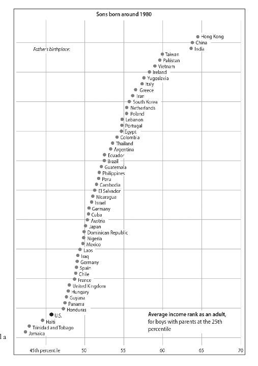

# *Streets of Gold*, Ran Abramitzky & Leah Boustan

As its title implies, Streets of Gold is a glowingly optimistic book about the impact of immigrants in the US. Abramitzky and Boustan, professors of economics at Stanford and Princeton respectively, make the argument that not only is the American Dream still alive, but it is just as alive as it was during the Ellis Island era golden age of immigration and that immigration is a net positive to not only immigrants but to the US as a whole. 

 

Before delving into their conclusions, let’s start by talking about what makes their analysis different - and more robust - than the ramblings immigration op-ed columnists. Typical discourse about immigration - a heated topic <em>du jour</em> no doubt - rests on a scaffold of random anecdotes, and as we all know, the plural of anecdote isn’t data. The first challenge Abramitzky and Boustan faced when trying to study immigration is to replace unreliable anecdotes with concrete data. Much of their analysis relied on developing novel approaches to process data sources like digitised census records connected to Ancestry.com profiles. The digitisation of these records allowed the researchers to feasibly plough through millions of past immigrants’ worth of records. With the ability to interact with census data all the way back to the turn of the 20th century, Abramitzky and Boustan can follow immigrants’ journey from when they come to see how their life/career evolve. For instance they can trace a certain James Alexander who was born in Wales and moved to the US in 1893. James started off as a coalminer in the heart of Pennsylvania. By the 1910 census, James is still working the same job but by the 1920 census, he has moved up to being a “foreman” and now has two children. With this level of granular detail, Abramitzky and Boustan are able to follow immigrants past and present very closely. The insights gained from this new data forms the basis of their conclusions. 

 

The first key insight is that the traditional “rags to riches” story is not correct. By using census data to follow people like James Alexander, they come to the conclusion that “Contrary to the rags-to-riches myth … poorer immigrants remained in lower-paid jobs throughout their lifetimes, never quite catching up with US-born workers”. The earnings differential was there for higher skilled immigrants during the first age of mass migration before the immigration quotas of the 1920s. Immigrants from rich countries like England and Germany “arrived with skills that enabled them to quickly find high-paying jobs and outearn US-born workers”.

 

Even though the ascent in the first generation of immigrants is stratified by skill level, Abramitzky and Boustan’s analysis of millions of records finds that “children of immigrants surpass their parents and move up the economic ladder both in the past and today”, with children of poor immigrants also displaying “substantial progress by the time they reach adulthood”. This pattern holds true not only across economic class, but also across ethnicities. The same pattern is present now among immigrants from Asia and Latin America as it was in the past during the age of European mass migration. 

 

To vividly illustrate this generational ascent, they tell the story of an immigrant called Tino, who was born in Mexico just across the border from Texas. By a stroke of luck, Tino’s father had been recruited to play basketball at a school on the US side of the border and ended up enrolling at the University of Alabama. Tino’s mother became pregnant in Alabama, but his parents went to Mexico to give birth since they thought it was “the patriotic thing to do”. Eventually his parents settled back in Mexico but became disillusioned with life there and dreamt of working as teachers in the US. They caught their lucky break when a consular official noted that they could speak English and gave them a limited amount of time to find jobs. Until then, Tino and his siblings had to remain behind in Mexico to ensure his parents didn’t try to overstay their visa. Tino’s father found work in a small desert town two hours from San Diego called Calexico where most kids were the children of farm workers and agricultural labourers. Many kids in Calexico found it hard to get to a four year college, but Tino worked his way to Harvard before getting a JD from Yale and a PhD from Stanford. Tino just happens to be <a href="https://en.wikipedia.org/wiki/Mariano-Florentino_Cu%C3%A9llar">Mariano-Florentino Cuellar</a>, a former justice of the California Supreme Court. Cuellar’s wife, <a href="https://en.wikipedia.org/wiki/Lucy_Koh">Lucy Koh</a>, is also the daughter of immigrants who escaped from North Korea on foot. Decades later, Koh became the first Korean American US District Court judge. Such stories are typical of the patterns Abramitzky and Boustan find in their data. More than anything, immigration to the US is a project of generational ascent.

 

One of the most memorable charts in the book is the figure on the right, which shows just how pervasive this generational ascent is. On the x axis, we have the average income rank as an adult for sons (born around 1980) of parents whose income was at the 25th percentile. For example for parents who were native born US citizens with incomes in the 25th percentile, we see that their sons ascended to just above the 45th percentile in income. From the chart, we see that virtually all sorts of immigrants from all over the world not only displayed the same generational climb, but they did better than native US born sons. The sharpest rise is for children of parents from Hong Kong, China, and India who jumped up to almost the 65th percentile. This chart gives the quantitative numbers that prove that stories like that of Cuellar and Koh aren’t exceptions but the norm for immigrants.

 

Of course economic success is only one dimension of immigration. The other critical dimension is social - do immigrants integrate into the new communities they find themselves in. Abramitzky and Boustan use a range of indicators to try to gauge the success of immigrant integration. The most fundamental is learning English - if immigrants do not speak the language of America, it is very unlikely they will be able to assimilate to any significant level. To assess this, they analysed a set of 1200 oral recordings from the Ellis Island Oral History Project which covers mostly European immigrants from the first mass migration. By assessing aspects such as vocabulary, accent, and sentence complexity, the authors develop methods to quantify English fluency. Unsurprisingly they found that immigrants who came as young children from any country spoke like natives, suggesting that full English fluency was at most one generation away. English proficiency is also understandably linked to economic success. By matching English proficiency scores to census entries, Abramitzky and Boustan could see that immigrants who spoke better English, even when corrected for factors like previous levels of education, earned more in their 1940 census forms. This unsurprising link is also supported by more modern studies, showing that there is a clear incentive for immigrants to learn English, often at the unfortunate cost of their own languages. Personally, I find it a very sad byproduct of the incredibly efficient process of assimilation in America that successive generations almost entirely lose their native languages, as opposed to places like Singapore where instead of assimilation into a common culture integration of different cultures is encouraged. Regardless, that immigrants almost universally pick up English to native level by the second generation is clear. 

 

The other signs of social assimilation that Abramitzky and Boustan study is where immigrants live, who they marry, and what they name their kids. First generation immigrants tend to cluster in regions such as Chinatowns in order to form communities and support each other in a foreign country. They mention how Korean Americans have such tight community connections that many Korean owned businesses forgo borrowing from banks in favour of borrowing from members of their own community. However by the second generation, many exit these immigrant enclaves in search for opportunity. The authors observe that among Jewish men in New York City in the early 20th century, those who left earned 5-10% more than those who stayed behind. Intermarriage rates are also increasing. In the past, the rates of marriage outside one’s own ethnic group ranged from 10% to 60% but today they range from 20% to 85%. 

 

Another test is whether immigrants give their children foreign sounding names - the example they give is Wajahat -  or plain American names like Lucy or John. By analysing census records, they could see what types of names are more likely to be given by immigrants vs the US born and they used this data to make the amusingly named “foreign name index” which quantifies how likely it is that a name was held by an immigrant (100) or nonimmigrant (0). Native born US moms gave their children names with an average score of 35 while immigrants who gave birth within the first three years had a higher score of 55. Over time immigrant scores tend towards native born US scores but don’t fully converge showing that immigrants do make some effort to retain their distinctive cultures. As with every other feature, this trend was universal across ethnic groups. 

 

Finally, Abramitzky and Boustan address the elephant in the room - do foreign workers hurt native born workers economically? Their answer is a pretty solid no. They arrive at this conclusion by studying the results of the 1920s immigration quotas which provided a natural experiment to see how drastically reducing immigration affected wages. The authors compare the cities of Cleveland and Cincinnati. Cleveland had a large population of Southern and Eastern Europeans who were barred from immigrating by the quotas, while Cincinnati had more Northern and Western Europeans who were mostly unaffected by the quotas. Since immigrants tend to go to places with people of similar origins, the immigration quotas drastically reduced immigration in Cleveland while leaving it mostly unchanged in Cincinnati. This provided a nice natural experiment to assess the impact of immigration. They found that although people in Cleveland may have enjoyed a temporary boost in earnings, eventually firms found ways to avoid paying higher wages by replacing Europeans with new immigrants like Mexicans, Canadians, and US born workers from other areas like the South. On farms, quotas did not result in more jobs for native US workers but instead more machinery and automation. Other events like the Bracero Program for guest workers from Mexico and the Mariel boatlift of Cubans into Miami had no significant impact on domestic wages. Finally, many immigrants are highly skilled and catalyse innovation and create new companies. These immigrants contribute much to the economy by creating new jobs and certainly improve the conditions for native US workers as well. 

 

Overall, Abramitzky and Boustan’s core argument rests on two key findings. Firstly, the overnight rags-to-riches story is mostly a myth and that most economic mobility manifests in the lives of children of immigrants in a pattern that is universal across all ethnicities both now and in the past. Secondly, despite the unfortunate xenophobic rhetoric, immigrants today from Asia and Latin America assimilate just as well as those from Europe a century ago as evidenced from their English proficiency and willingness to live with and marry those outside of their ethnic groups. These findings are based on extensive quantitative analysis of data and brought to life through anecdotes that vividly illustrate the abstract trends of the millions of immigrant census records. Finally, the authors make a powerful case that immigration is a net positive for the US and that legislators ought to keep these economic and social facts in mind when legislating this fraught and misunderstood topic. For these reasons, Streets of Gold is a must read for anyone interested in genuinely understanding the economic and social impact of immigration on the US. 

 