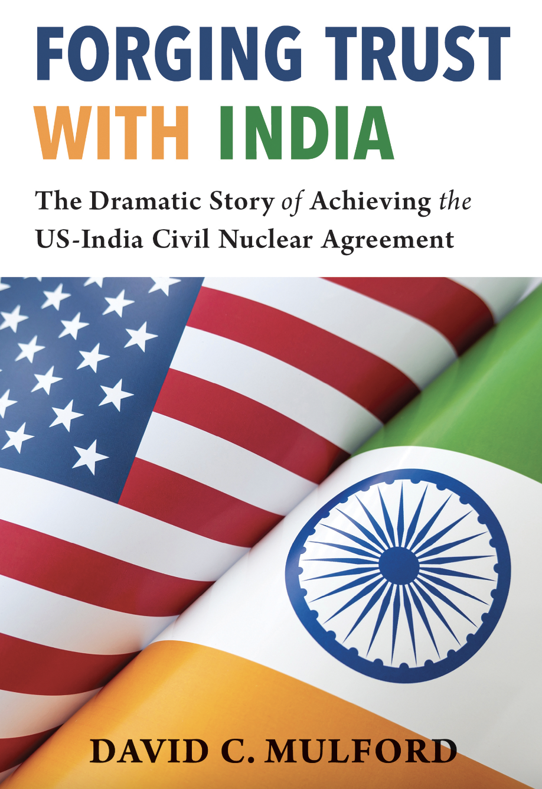

# *Forging Trust With India*, David Mulford

Forging Trust With India is a small but insightful book about how the US and India reset their relationship in the early 21st century after the mistrust and hostility of the Cold War. Written by former US ambassador to India David Mulford, it offers a glimpse into  all the high stakes diplomacy required to bridge the gap between the world’s oldest and largest democracies from someone who was right in the middle of the action.  

 

The central focus of the book is the US-India Civil Nuclear Agreement. As former Secretary of State Condoleeza Rice mentioned at the panel where I got this book, President George W. Bush was very enthusiastic about improving relations with India. The US had recently slapped sanctions on India following its 1998 nuclear weapons test. Despite not being a signatory to the Nuclear Non-Proliferation Treaty (NPT), it had demonstrated that it was a responsible nuclear weapons state so the Americans believed it would be a gesture of goodwill to integrate India into the world of nuclear commerce. This would also be significant because it would recognise India as a de facto legitimate nuclear weapons state despite it not approving the NPT.

 

Achieving this would require a lot of delicate diplomacy. Speaking from the US perspective, Mulford notes that such an initiative would be a “radical departure from US nuclear policies of the previous fifty years”. India would need to split its civil and military nuclear capacities and the US would need to amend its domestic legislation to carve out a special exemption for India in the Atomic Energy Act. Clearly this was a monumental challenge which required a lot of political capital, especially for two diplomatic corps that had historically not trusted each other much but Mulford gives us an insight into the room where these high stakes negotiations were being held. Of course there are the good moments, such as the grand state visits by President Bush and Prime Minister Singh, but he is also candid about the bad moments. For example he notes that in 2007 “further progress seemed doubtful” because of Indian demands over nuclear fuel. In 2008, when leftist parties in the governing coalition forced the government to halt nuclear deal negotiations, Mulford notes that it felt like a “fatal blow”. More than the successes, these moments give a more interesting insight into how such monumental agreements can fall through the cracks for the most arcane of reasons. Nevertheless, the two countries were able to get the deal done. 

 

One might think that as the US ambassador Mulford might give a US biased view. However, I found him to be a fair observer of events. For example, he understood that the fatal blow of 2008 was a result of Indian democracy and not of the Indians being unnecessarily difficult as many of his exasperated colleagues might have. Later on in the book he is also quick to call out the US double standard on Pakistan. After the 2005 Sarojini Market attack in Delhi, the US continued to supply nuclear capable F-16s to Pakistan whose most salient use would be against India. He notes that despite this, the State and Defense Departments as well as US intelligence agencies “all continued to assume that India should fully cooperate with the United States … with not commensurate action by the United States against Pakistan”. In a statement that will resonate with many Indians, Mulford pointedly states that the US attitude to the “outrageous violence flowing into India from Pakistan … struck a severe blow to its credibility in India”. Candid introspection like this is rare from Americans so I found this quite refreshing. 

 

The remainder of the book is about other aspects of Mulford’s time serving in India, such as reforming the visa process and taking initiatives to create more people-to-people ties. Examples of this include his efforts to strengthen the Fulbright India program as well as launching more summits between CEOs of companies in both countries. A non-trivial portion of the book is also focused on his wife Jeanie’s battle with breast cancer, which I was happy to see she recovered from. Not only that, but her experience helped in destigmatising breast cancer in India.

 

Forging Trust With India is a handy little read which gives a sense into what it took to create the foundation on which the burgeoning US-India relation today is based. Overcoming the hesitations of history was a monumental challenge requiring tricky diplomacy. It was certainly interesting for me as an Indian to see what the other side thought during the moments of high stakes diplomacy. Overall this was a fun read to see what types of challenges a diplomat needs to overcome and what sort of skills they require to bridge the divides between countries. 

 