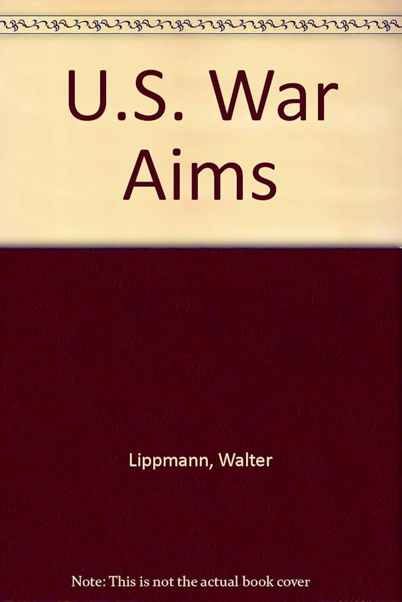

# *US War Aims*, Walter Lippmann

US War Aims is, in the author’s own words, a “little book on a big subject”. Written by influential 20th century commentator Walter Lippmann in 1944, as the allies are mounting the final offensives of WW2, this little book aims to outline a set of objectives the US should pursue to prevent a calamity like this from ever befalling it again. 

 

The book starts with an overview of the background that led to American involvement in the war. What I am struck by  is Lippmann’s astute strategic reading of the situation. In the beginning he has that typical American flourish of moral superiority, arguing that America is fighting because they have an intrinsic revulsion for colonial domination. I was particularly intrigued by how America acted as ‘China’s champion’, trying its best to shield it from colonial dismemberment. These sentiments may well be true but as everyone knows I’m a big skeptic of moral sentiments being the driving force behind geopolitics. Sure enough after this little flourish, Lippmann gets to what I think is the real reason - the fact that the US cannot be secure with a hostile strong power in either Europe or East Asia.

 

He notes that America’s natural zone of interest is the great oceanic basin spanned by the Pacific and Atlantic oceans. Any powerful hostile force on either side of this basin would threaten American interests. I was a bit surprised when I read this, because in my strategic conception of the world the US is indeed virtually invincible.. There’s that famous quote from Lincoln that “All the armies of Europe, Asia, and Africa combined, with all the treasure of the earth (our own excepted) in their military chest, with a Bonaparte for a commander, could not by force take a drink from the Ohio” which of course is a very compelling case. Who has the resources to first cross a vast ocean and then launch a grueling continental scale amphibious assault?

 

But Lippmann made a very powerful and simple argument. He argued that a hegemon in either Europe or Asia would be able to first isolate the United States through strategic conquests and then mobilize all the considerable resources to launch an attack on the US mainland. For example he argued that if Germany had successfully defeated Britain, then then entire Atlantic would’ve been open to the German navy. It could have rolled over Iceland and Greenland before attacking Canada and having a direct line to the US. With the British navy out of commission, it may have also launched attacks from the African coast to South America. An invasion from the other side of the Pacific would be tougher because of the larger distance, but a Japan in full control of China and Southeast Asia would have so many resources and manpower at its disposal that it could pose a threat to America through Hawaii and Alaska.

 

This analysis was written before the advent of nuclear missiles so it doesn’t apply completely anymore, but I think it’s very astute for its time and still somewhat valid today. It certainly made me reevaluate my notion that America is essentially invincible. It also made me realize why the Americans were so eager to get security treaties with Western Europe, Japan, Korea, the Philippines, Australia, and New Zealand. If you look at the American nuclear umbrella on a normal world map, it looks like a containment blanket on Eurasia. But if you look at it on a US-centred world map, it looks exactly like a buffer between the US oceanic basin and everything else on the outside. It's a genius strategic policy.

 

Having outlined the situation that led to war, Lippmann spends the last part of the book arguing for a sort of collective security mechanism. His vision argues essentially for the splitting of the world into spheres of influence, although he doesn’t call it such. One is the “Atlantic Community”, comprising the US, Canada, Western Europe, and South America. According to him, these countries cannot ever go to war with each other because that would fatally compromise all of their security because it would give a hostile external power a vector into the Atlantic region. Facing this is what he calls the “Russian Orbit”, which includes the USSR and Eastern Europe. Lippmann’s realism is amply visible here as he is willing to concede Eastern Europe to the Soviet sphere of influence, although he does express hope that the Soviets will not pursue an interventionist foreign policy in its neighborhood. Finally he foresees in the future a regional system centred around China. In one of the most astute observations of the book, he notes that “The rise of China will also precipitate great questions for the British… and indeed also the other Atlantic powers, including the United States”. Impressive foresight considering this was written in 1944. 

 

He does concede to objections that these divisions will end up being spheres of influence where great powers dominate their smaller neighbours. However he views such spheres as a matter of fact since they already exist. He further says that “only by perfecting these regional groupings can we hope to make any progress towards stabilising international relations”. This is a very realist reading of international relations, one that I believe conforms well with the lessons of history. 

 

Lippmann wants that the global order of the postwar era rest not on all the countries of the world joining a flawed League of Nations type body, but on the cooperation of these separate regional groupings (spheres of influence) in some type of “World Council”. Throughout the book he is very critical of Wilson’s Fourteen Points as being idealistic and doomed to failure. Unlike the Fourteen Points, which tried to appeal to higher spirits within nations, Lippmann’s world order would appeal more to the interest of nations. A World Council should not aim to govern like the League of Nations but have the more humble aim of being a council where governments consult. Crucially, it should not infringe on all the affairs of its constituent states. For example, if there is a dispute between Panama and the US, there is no need to have all of the nations of the world weigh in on it in some collective Wilsonian system. 

 

One tricky question is how specifically to deal with Japan and Germany. On this he is clear that both countries must be allowed to rejoin the community of nations on an equal footing at least in commerce. In the matter of persecuting trials once the war is over, he argues that it is best for the Chinese to take the lead against Japan and the Europeans to take the lead against Germany. Very prudent and sober advice that ultimately didn’t end up being followed, especially in the case of Japan. With regards to Germany in particular, he argues that it should be integrated into the Atlantic Community so that it never has the ability to hold the balance of power between the Atlantic and Russian spheres of influence. This is indeed exactly what ended up happening and since then, Germany has been a strategic nonfactor on the global stage. Masterfully executed. 

 

This little book was a fascinating read, both for the context that led to US intervention as well as the thinking behind designing a future world order. Particularly enlightening for me was reframing my viewing of America’s strategic sphere not as North America but the entire Pacific-Atlantic Basin. It is also very interesting to see which of Lippmann’s predictions came true in the decades following this book, as it helps me orient myself when thinking about how to predict trends and patterns in the decades to come during a time when the current global order is giving way as well. Finally, analysing his way of thinking gives me plenty of food for thought regarding what I think a future world order should look like as Pax Americana recedes into history. 

 