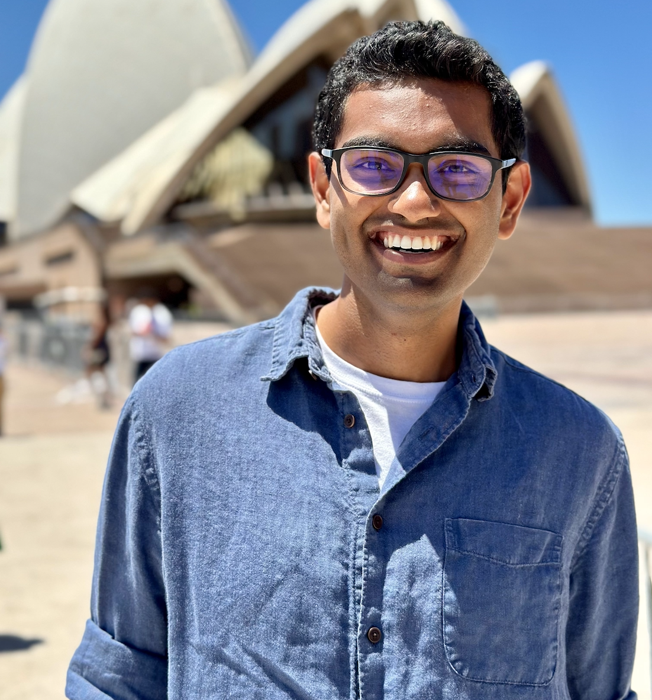

<!---
Text can be **bold**, _italic_, or ~~strikethrough~~.

[Link to another page](./another-page.html)

There should be whitespace between paragraphs.

There should be whitespace between paragraphs. We recommend including a README, or a file with information about your project.
--->
# About Me


<!-- -->

I am a fifth year Physics PhD student at Stanford University advised by Kent Irwin. My main interest is applying the methods of quantum metrology to enhance searches for axion dark matter. 

My focus is on building superconducting radiofrequency resonators, understanding quantum noise in these frequency ranges, and developing new sensors/protocols to evade the standard quantum limit on measurement in dark matter searches.
In this, I am generously supported by the governments of Australia, India, Japan, and the United States through the [Quad Fellowship](https://www.quadfellowship.org/). 

Previously, I was at UC Berkeley working on neutrinoless double beta decay and
WIMP dark matter detection. Before that, I was born in [Delhi](https://www.youtube.com/watch?v=DxRxTlkI3gY&ab_channel=NetflixIndia) and raised in [Singapore](https://www.youtube.com/watch?v=uByyHDXlEqM&ab_channel=TropicMonstersTV) & [Dubai](https://www.youtube.com/watch?v=fbL9QdWWJzo&ab_channel=Emirates). 

Outside of physics, I am very interested in the intersection of [geopolitics and emerging technologies](https://jyotirmai.substack.com/).
Previously I've served on the Stanford Graduate Student Council where I was fortunate to work on issues of [affordability for graduate students on campus](https://stanforddaily.com/2022/01/20/stanford-unveils-measures-to-tackle-affordability-issues/).
This website also hosts [my other essays](./writings.md) and [book reviews.](./books.md)

I also really like learning new languages. I've been most successful with [French](./index-fr.md), [Turkish](./index-tr.md), [Persian](./translation/shahnameh/shahnameh_blog.md), and ancient languages like
[Latin](./index-lt.md), [Sanskrit](./translation/gita/gita.md), and [Avestan](https://www.youtube.com/playlist?list=PLdEjXxfweLgZkCQjm6Lvs-dKoWJLdM6Qq).

You can get in touch with me via [email](mailto:joesingh@stanford.edu) or follow me on [Twitter](https://twitter.com/SinghJyotirmai). 


# Publications/Articles

* M.H. Kelsey et al., _G4CMP: Condensed Matter Physics Simulation Using the Geant4 Toolkit_, [Nuclear Inst. and Methods in Physics Research, A 1055, 168473 (2023)](https://www.sciencedirect.com/science/article/pii/S0168900223004631?via\%3Dihub)

* Stephen E. Kuenstner, Elizabeth C. van Assendelft, Saptarshi Chaudhuri, Hsiao-Mei Cho, Jason Corbin, Shawn W. Henderson, Fedja Kadribasic, Dale Li, Arran Phipps, Nicholas M. Rapidis, Maria Simanovskaia, **Jyotirmai Singh**, Cyndia Yu, Kent D. Irwin, _Quantum metrology of low frequency electromagnetic modes with frequency upconverters_,
[arXiv:2210.05576 (2022)](https://arxiv.org/abs/2210.05576)

* L. Brouwer et al. (DMRadio Collaboration), _Projected Sensitivity of DMRadio-m3: A Search for the QCD Axion below 1 µeV_, 
[Phys. Rev. D 106, 103008 (2022)](https://journals.aps.org/prd/abstract/10.1103/PhysRevD.106.103008)

* L. Brouwer et al. (DMRadio Collaboration), _Proposal for a definitive search for GUT-scale QCD axions_, 
[Phys. Rev. D 106, 112003 (2022)](https://journals.aps.org/prd/abstract/10.1103/PhysRevD.106.112003)

* **Jyotirmai Singh**, Preey Shah, _Investing in the future of Indian Science_,
[Observer Research Foundation (2022)](https://www.orfonline.org/expert-speak/investing-in-the-future-of-indian-science/)

* B. Aharmim et al. (SNO Collaboration), _Measurement of neutron production in atmospheric neutrino interactions at the Sudbury Neutrino Observatory_,
  [Phys. Rev. D 99, 112007 (2019)](https://journals.aps.org/prd/abstract/10.1103/PhysRevD.99.112007)

<!---
## Header 2

> This is a blockquote following a header.
>
> When something is important enough, you do it even if the odds are not in your favor.

### Header 3

```js
// Javascript code with syntax highlighting.
var fun = function lang(l) {
  dateformat.i18n = require('./lang/' + l)
  return true;
}
```

```ruby
# Ruby code with syntax highlighting
GitHubPages::Dependencies.gems.each do |gem, version|
  s.add_dependency(gem, "= #{version}")
end
```

#### Header 4

*   This is an unordered list following a header.
*   This is an unordered list following a header.
*   This is an unordered list following a header.

##### Header 5

1.  This is an ordered list following a header.
2.  This is an ordered list following a header.
3.  This is an ordered list following a header.

###### Header 6

| head1        | head two          | three |
|:-------------|:------------------|:------|
| ok           | good swedish fish | nice  |
| out of stock | good and plenty   | nice  |
| ok           | good `oreos`      | hmm   |
| ok           | good `zoute` drop | yumm  |

### There's a horizontal rule below this.

* * *

### Here is an unordered list:

*   Item foo
*   Item bar
*   Item baz
*   Item zip

### And an ordered list:

1.  Item one
1.  Item two
1.  Item three
1.  Item four

### And a nested list:

- level 1 item
  - level 2 item
  - level 2 item
    - level 3 item
    - level 3 item
- level 1 item
  - level 2 item
  - level 2 item
  - level 2 item
- level 1 item
  - level 2 item
  - level 2 item
- level 1 item

### Small image


### Large image


### Definition lists can be used with HTML syntax.

<dl>
<dt>Name</dt>
<dd>Godzilla</dd>
<dt>Born</dt>
<dd>1952</dd>
<dt>Birthplace</dt>
<dd>Japan</dd>
<dt>Color</dt>
<dd>Green</dd>
</dl>

```
Long, single-line code blocks should not wrap. They should horizontally scroll if they are too long. This line should be long enough to demonstrate this.
```

```
The final element.
```
--->
