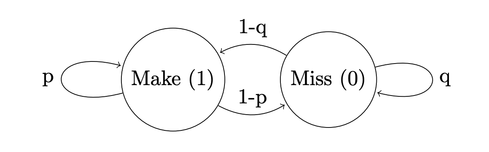
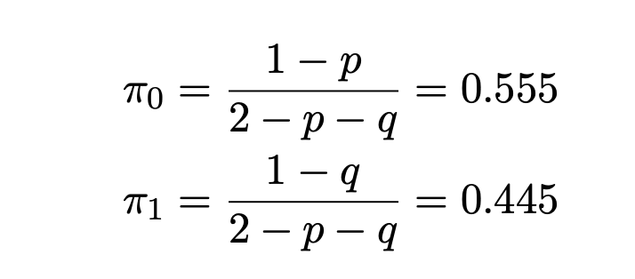

<!---
Text can be **bold**, _italic_, or ~~strikethrough~~.

[Link to another page](./another-page.html)

There should be whitespace between paragraphs.

There should be whitespace between paragraphs. We recommend including a README, or a file with information about your project.
--->
# The Mamba Mentality

Kobe Bryant capped off his Hall of Fame career by scoring 60 points against the Utah Jazz at home. He did so in
exactly 50 field goal attempts. In this respect, that last game serves as a perfect microcosm of Kobe’s 20 seasons
in the league; an elite scorer unmatched by anyone at his prime, and an unabashed gunslinger never hesitant to
let it fly from almost anywhere on the court. It was no coincidence that Kobe was the highest volume perimeter
shooter in the history of the game with 26200 attempts, surpassed only by elite inside players Karl Malone (26210)
and Kareem Abdul-Jabbar (28307). It is, therefore, instructive to take a closer look at Kobe’s shot selection
patterns and their results. In particular we will address the question of the hot hand, the idea that field goal
percentage increases following a hot streak of made shots. Via a Markov Chain Model, we demonstrate that past
shots had little notable effect on Kobe’s percentages. In this way, we argue that Kobe Bryant’s confidence was a
manifestation of the memoryless property of his shooting.

### What Hot Hand?
Kobe was renowned for going on streaks where he looked unstoppable. This hot hand theory is wildly popular,
applied to virtually any NBA player who makes a few shots in a row, and no doubt the casual player has experienced
that sensation of confidence at the local gym. But do these assumptions hold weight when we analyse Kobe’s
numbers?
Let’s examine how different aspects of Kobe’s game change with his attempts. If the criticisms are true,
and Kobe just jacked up bad shots even when he was in a funk, we could expect a higher number of attempts
to correlate with a lower percentage. Alternatively, if the field percentage increases with attempts, then some
credence could be given to the theory. Here is Kobe’s FG percentage vs FG attempted – in the following charts
the 2013-14 season has been dropped since he only played 6 games:

{:.image-caption}
*
Kobe Bryant FGA vs FG%.
*

There certainly some positive correlation, but this itself is not completely conclusive. It could be that more made
shots simply give more confidence and result in a better shooting percentage. Correlation, however does not imply
causation so this itself is not conclusive. What it does say, however is that we should pursue a further exploration
of the numbers to look for the hot hand effect.
Up till now we have not made much distinction between 2 point and 3 point field goals, so let’s compare FGA vs
True Shooting Percentage. We use TS% This accounts for the fact that a 3 pointer is worth more and accordingly
contributes more to the percentage:

{:.image-caption}
*
Kobe Bryant FGA vs TS%.
*

Ignoring the two points at the bottom, which were from the
last few seasons when Kobe was in terminal decline, we see that the data hovers consistently around a TS% of .55
to .56. Accounting for the difference between 2 and 3 point field goals appears to make the change in percentage
less pronounced. At the very least, the numbers suggest that shooting a 3 did not give Kobe proportionally more
of a hot hand. That is to say, shooting a 3 did not appear to enhance Kobe’s shooting much more than shooting
a 2 did, suggesting that if the hot hand exists, it had a uniform impact over 2 point and 3 point field goals.

### A Deeper Look at the Hot Hand
The data doesn’t present a firm conclusion on the hot hand so far. To get more concrete results, we need to get
a more concrete statistical model going. We will make one simplifying assumption, namely that if the hot hand
exists, its impact does not extend forever. This means that if past shots have an impact on present shots, then
the most recent shots have the most important impact. In order to make this problem somewhat tractable, we
further strengthen this assumption by arguing that Kobe’s shot making obeys the Markov Property, viz. the only
shot with discernible impact on the present is the immediate shot before.
Let X(i) be the random variable that is 1 if shot number i is a make and 0 otherwise. The Markov Property allows
us to claim that X(i+1) | X(i)
is independent of X(i) | X(i−1). Now we aim to estimate the probabilities of makes and misses
given the previous shot, pmake and pmiss.
It is difficult to find shot tracking data for NBA players since the NBA clamped down on data scraping (the
absence of which the NBA attributes to a SportVU glitch which has apparently lasted for over a year). Nevertheless,
there is a [Kaggle Dataset](https://www.kaggle.com/c/kobe-bryant-shot-selection) on Kobe Bryant’s Shot Selection that provides information on a large amount of his field
goals (not all since some data is omitted). In particular, the dataset contains 11466 attempts which come after a
make, and 14232 which come after a miss. A simple manipulation yields the following probabilities:

|  | After Make | After Miss | 
|:-------:|:----------:|:----------:|
| P(make) | 0.4396 | 0.4514 | 
| P(miss) | 0.5603 | 0.5486 |  
{:.image-caption}
*
Kobe Bryant's field goal percentages on shots that come after made and missed shots.
*

The key use of our assumption is that now we can bound the errors on these probabilities. Using the Central
Limit Theorem (those concerned with technicalities can find a calculation at the end), we get bounds of ±0.0092
and ±0.0082 for P(make) and P(miss) at 95% confidence. So these
estimated values are pretty solid, and comparing them to Kobe’s overall mark of pmake = .447 we see that they
don’t differ significantly enough to suggest any major difference after makes or misses. They are both within the
95% threshold meaning that they are sufficiently close to the overall percentages to be classed as good estimates
for those percentages. Yet again, the gambler’s fallacy - recast as the hot (or cold) hand- doesn’t seem to survive
closer scrutiny. Of course, while this analysis was very limited due to the Markov Property, others (see Gilovich, Cognitive Psychology 17, 295-314 (1985)) have conducted
more thorough analyses which also dispute the existence of a hot hand.

### Just for Fun: A Markov Chain Analysis

{:.image-caption}
*
A basic Markov Chain model for Kobe's shooting.
*
Just for fun, since we have modeled Kobe’s shots with with a Markov model, let’s consider some Markov Chain
type questions and see if they give us any new insights. One obvious question we may ask is that given that
Kobe missed his first shot, how many shots will he take to make his first one. The stopping time equation here is
exceedingly simple:

Where q is the probability of a miss given a miss, 0.5486. Thus under this model, we would expect Kobe to take
2.22 shots before his first make, if we know his first shot was a miss. Alternatively if his shot was a make, by the
same analysis as above, just replacing q with p, we estimate that Kobe takes 1.78 shots before he misses.
Are these results correct? We can employ a simple but fairly inelegant procedure to calculate these averages
from the raw data. Simply take the array of shot data, and order the shots by game. We can then map game IDs
to arrays containing the shot attempts in those games, and in these arrays we can simply start at every miss and
see how many missed shots till the next make and then average this value over the game. Finally we average the
averages over all the data. It must be remembered that our dataset isn’t complete, but since it uses 25699 out
of the 26200 attempts of Kobe’s career, these actual numbers are very good estimates of the actual values. For
brevity, let’s call the average number of attempts till a make starting from a miss the cold time and the average
number of attempts till a miss starting from a make the hot time. Doing the procedure above gives the following
results:

 |  | Cold Time (# attempts) | Hot Time (# attempts) |
 |:-------:|:----------:|:----------:|
 | Actual | 2.21 | 1.83 |
 | MC Prediction | 2.22 | 1.78 |

The Markov Chain model results are again very close to the actual results.

This Markov Chain is also special in that it is irreducible (we can get from any state in the graph to any other
state) and aperiodic since it has self loops. So we can ask about the long term probability distribution of being in
states Make and Miss. Let’s construct the balance equations:

Where p = 0.4396, q = 0.5486 from the table above. π(0) and π(1) are the long term probabilities of ending up in
the miss and make states respectively. These, together with the normalisation condition (π(0) + π(1) = 1), yield the
following:

These numbers don’t appear too special, but compare 0.445, the long term probability of ending up in state 1,
vs Kobe’s overall career percentage, 0.447, and we see that these two numbers are remarkably close. In fact, the
difference is well within the margin of error from the above CLT calculations. This supports the validity of the Markov Property
assumption, since it produces almost exactly the long term result that we expect from Kobe's actual shooting data.

### Conclusions: The Benefits of a Short Term Memory

The league will need to wait for a while till it sees another gunslinger totally unperturbed by the prospect
of jacking up 50 shots in his last game. However, as the above analysis of his shooting demonstrates, no matter
what he felt mentally, there is concrete evidence to suggest that Kobe’s shot making followed the Markov property
very closely - there was little to none hot or cold hand overall. The fact that the probabilities of a make given a
miss or a make are so close to his overall field goal percentage strongly suggests that each shot result overall is
independent of each shot result before. The success of the Markov Chain model at predicting the length of Kobe’s
average cold and hot times is also a strong indication of the validity of applying the Markov Property. Of course,
this does not mean you should launch full court heaves regularly. The key lies in the right balance of confidence
and good shot selection with shots taken in rhythm.
The above is of course a strong statement, and most will immediately argue that anybody playing pickup can
feel the effects of a hot hand. Of course, this work is not conclusive, and an immediate next step is to apply
the same techniques to other prolific scorers such as Kareem Abdul- Jabbar, Michael Jordan, LeBron James, and
Kevin Durant among others. Nevertheless, the sheer volume of data analysed means that our conclusions can’t be
disregarded just because of ‘feelings’. We may attempt to reconcile this observation by noting that an elite scorer
like Kobe would have a consistency between shots. That is to say his shot form is unlikely to change too much
between shots. It is common basketball wisdom that the best shooters have extremely consistent shot forms and
Kobe was no exception. Such factors that vary much more for the typical casual player than for a Hall of Fame
scorer could have an impact on the independence of shots.
Finally, however, these numbers could provide motivation to those who seem to always lack confidence on the
court during games despite having a decent level of skill. The message appears to be that if one is confident
and does not let past misses affect the psyche, they could potentially develop the same independence of shot
attempts that is apparent in Kobe’s career. The technical term for this in statistics is being memoryless, that
is the outcome at some time is completely independent of what happened before. Kobe’s numbers back up his
unabashed confidence and lack of hesitation in jacking up shots. Whether it contributed to or detracted from
winning of course remains another matter - comparing stats like Win Shares vs FGA might be a good way to start
thinking about that. Nevertheless, when it comes to sheer offensive production, any coach will say that there’s
hardly any substitute to plenty of practice, rhythm, and confidence. Don’t be a ballhog on the hardwood, be a
shooter. Ideally, a forgetful, memoryless shooter.

