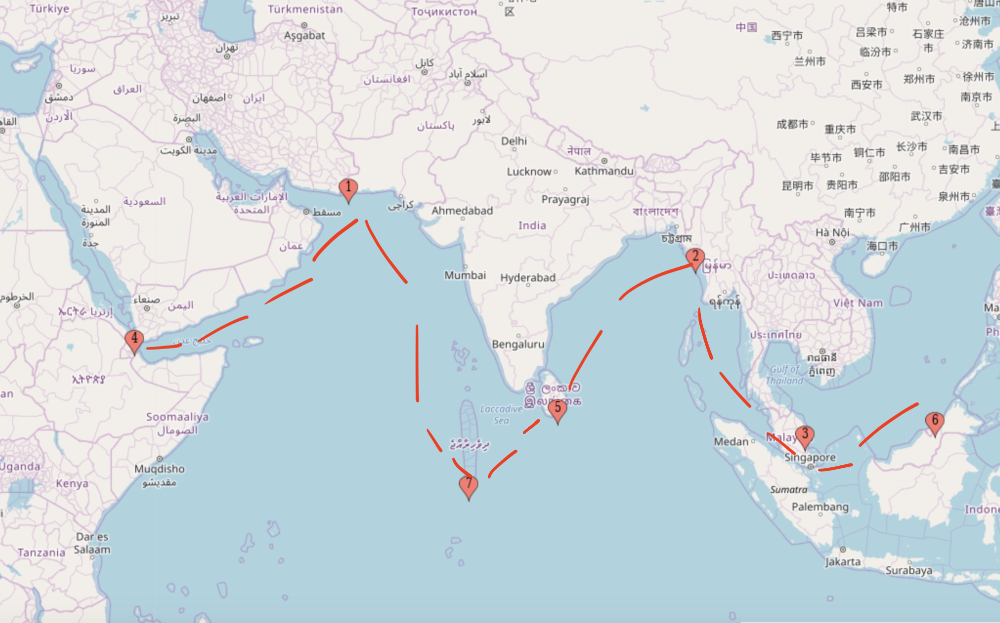

# China's New Silk Road and The Revenge of History

In 2013, Chinese Premier Xi Jingping announced the largest infrastructure investment effort in history, dubbing this grand project the Silk Road Economic Belt and 21st Century Maritime Silk Road. These initiatives aim at large investments by an economically resurgent China to bring forth dams, bridges, and ports throughout the Indian Ocean littoral and Eurasian heartland. The name is more than apt, as China is trying to do no less than recreate the Silk Road of the past that catalysed the transfer of goods and ideas between East and West and served as an unmatched tool for soft and hard power projection for the state that controlled it, like the Mongol Empire. While the Silk Road sprung organically, the modern Belt and Road Initiative (BRI) is a deliberate decision by China - inspired by the past - to enhance its influence in its immediate periphery and potentially extend it across Eurasia. BRI will do this primarily via economic investments that enhance integration and catalyse trade. However, as BRI ramps up, China’s neighbours rightfully worry about safeguarding their sovereignty against the negative consequences of its foray into regional development. Such consequences include excessive Chinese influence upon participant countries and debt traps from grandiose projects stuck in quagmires such as the Hambantota port in Sri Lanka.

To adequately discuss BRI, we must start with its historical inspiration, the Silk Road. The Silk Road was an extensive network of trade routes connecting the Chinese heartlands to the Mediterranean from the 2nd century BCE to the 18th. Initially spurred into existence by the Chinese monopoly on silk manufacture under the Han dynasty, the Silk Road gradually evolved into a catalyst for the exchange of goods and ideas across East and West. 

{:.image-caption}
*
A map of the historical Silk Road, with overland routes in red and maritime routes in blue. Image from <a href="https://upload.wikimedia.org/wikipedia/commons/7/74/Silk_route.jpg">Wikipedia</a>
*

It was also an engine of soft power projection; the Chinese monopoly of silk, which remained the most coveted luxury in Eurasia for centuries, did much to elevate the perception of its civilisation. The contemporary preponderance of Buddhism - a South Asian faith - in East Asia also owes significant thanks to the Silk Road, which served as a catalyst for the transmissions of Mahayana, Theravada, and Tibetan Buddhism throughout Eurasia. Central Asia, although primarily ethnically Turkic today with the exception of Tajikistan (which is primarily Iranian), presents a unique mélange of Islamic, Persian, and Turkic traditions. Islam is the dominant faith of the region, yet Nowruz - the pre Islamic Persian New Year festival - is still celebrated in each of these countries. The name has also remained almost unchanged, being Nowruz in Turkmen, Navr’oz in Uzbek, Нооруз (Nooruz) in Kyrgyz, and Наурыз (Naurız) in Kazakh. Christianity also benefited from the Silk Road, reaching the apex of the Mongol Empire with Sorghaghtani Beki, Genghis Khan’s daughter in law who took key policy decisions in the 13th century to usher in a more cosmopolitan Mongol Empire. Although herself Nestorian Christian, Sorghaghtani Beki instilled tolerance in her sons who later  - as Great Khans of the largest contiguous empire in history - promulgated the notion of state over religion from the Mediterranean to the Pacific. This control over the entire Silk Road and its vibrant flow of goods and ideas benefitted the Mongol economy immensely. The Mongols in turn reciprocated by using their authority to catalyse trade and integration across Eurasia - for instance through their efficient postal services. This illustrates the remarkable symbiosis between the Silk Road and Pax Mongolica, and crucially the immense soft and hard power possibilities that leveraging control over the entire Silk Road could give.

{:.image-caption}
*
The (overland) Silk Road superimposed on the Mongol Empire at the end of the 13th century. Although by this time the Mongol Empire had fractured into 4 de facto independent states, all remained under the control of
Genghis Khan's descendants and the Golden Horde, Chagatai Khanate, and Ilkhanate nominally swore loyalty to the Great Khan of the Yuan Dynasty. Image from this <a href="https://www.sutori.com/story/genghis-khan-and-the-mongols--uUhKuiwYJ41h2Arf4diaa22g">awesome quiz about the Mongol Empire.</a>
* 

Given the immense geopolitical potential of connecting East and West and controlling that connection, it is hardly a surprise that a resurgent China would wish to (re)mobilise the Silk Road to expand its influence across Eurasia. Today’s China enjoys benefits that its Han predecessor did not, such as controlling ~20% of global manufacturing output and being the key node in global supply chains. All this gives China’s BRI project immense potential. With this in mind, it is easy to identify two critical objectives of BRI. The first is stated clearly by one of Beijing’s mouthpieces: “[BRI] aims to promote … highly efficient allocation of resources and deep integration of markets by enhancing connectivity of Asian, European, and African continents and their adjacent seas”. That there are economic benefits possible from such integration is certainly true, as evidenced by the positive impacts of Pax Mongolica and the Silk Road. Notable also is the inclusion of Africa, which indicates China’s ambition. As we will see, the Chinese are very serious about outdoing the Mongols and getting deeply involved in Africal. The second objective, which China routinely downplays but analysts repeatedly emphasise, is the expansion of its influence by using BRI as a conduit for soft and hard power projection. In this respect, we must be careful to not assign malignant intentions to China, as western analysts are prone to do. Beijing is simply pursuing a course of action expected of a civilisation state with a long and proud history riding a resurgence back to the upper echelon of the global order. 

China is implementing these objectives through BRI primarily via infrastructure and development investment in target countries. 
Notably, the distribution of countries signed up to BRI includes not only Eurasia and Africa, but also Latin America. 

{:.image-caption}
*
The countries that have signed cooperation documents related to BRI in blue (China itself in red). Image from <a href="https://en.wikipedia.org/wiki/Belt_and_Road_Initiative#/media/File:Belt_and_Road_Initiative_participant_map.svg"> Wikipedia.</a>
*

However, geopolitics dictates that the most important BRI projects remain those in Eurasia and along the Indian ocean littoral. Eurasia is home to the vast majority of the world's population and thus affords the largest potential for global integration. As it relates
to Chinese prestige, Eurasia is also home to the most critical constested spheres of influence, such as the Middle East, Southeast Asia, and Central Asia. Gaining a foothold in these critical theatres will do much to enhance China's
position vis-à-vis the United States and challenge its role as the global hegemon. The advance into Latin America, while a notable advance on the historical blueprint provided by the Han and Mongol Empires, is currently not as significant since Latin America remains a mostly uncontested US sphere of influence for the time being. Turning to Eurasia then, the most prominent examples of BRI projects include the CPEC in Pakistan and the wholesale construction of ports
along the Indian ocean to advance the Maritime Silk road. 

{:.image-caption}
*
A map of China's Belt and Road Initiative, showing the Silk Road Economic Belt in orange and the Maritime Silk Road in blue. Note in particular the economic corridors through Pakistan and Myanmar that give China access
to the Indian Ocean. Image from <a href="https://www.researchgate.net/figure/Map-of-BRI-regions-and-projects_fig1_327159506"> Lu et al.</a>
*

The China-Pakistan Economic Corridor, or CPEC, is a major pillar of the overland Silk Road whereby China is investing extensively in transport and infrastructure projects in Pakistan. This includes a vast network of highways and railways that will replace Pakistan’s current dilapidated transport networks. The Karakoram Highway from Punjab to the Chinese border will be completely rebuilt, and its railway network will eventually be extended to join the Southern Xinjiang Railway in Kashgar - an oasis city which has been a transit point between Central and East Asia for centuries.

{:.image-caption}
*
A detailed look at the network of CPEC transportation and energy projects. Note how the extensive network of highways leads from the Chinese border all the way to the Indian ocean. Also of interest is the diverse range
of energy projects China is investing in, including coal and an assortment of renewables. Image from the <a href="https://foreignbrief.com/daily-news/prime-minister-imran-khan-will-meet-with-chinese-leaders-in-beijing-to-revive-the-cpec-project/"> Council on Foreign Relations.</a>
* 

In addition, the CPEC also includes various energy projects targeting coal and renewable energy. Initially valued at $46 billion, as of 2017, the value of CPEC investments is at $62 billion. The initial figure of $46 billion was equivalent to the cumulative FDI into Pakistan since 1970 and was 17% of Pakistan’s 2015 GDP.  The CPEC has been considered analogous to the Marshall Plan in its impact on Pakistan’s economy and from its size relative to Pakistan’s economy it is no surprise why. Pakistani officials estimate that the CPEC will generate approximately 2 million jobs and add 2-2.5 percentage points to annual GDP growth. The CPEC culminates in the port of Gwadar that the Chinese are constructing on the Indian Ocean. This is absolutely vital, as it reveals the key benefit Beijing receives for its largesse - an alternate corridor to the Indian Ocean that bypasses the Strait of Malacca. This makes China less vulnerable should an adversary attempt to target it by blocking Malacca - through which 80% of China’s energy exports go currently. Therefore the CPEC gives a massive boost to the Pakistani economy, which enables it to engage in more trade with China, and creates an alternate channel for China’s energy imports. This explains the pragmatic value of the CPEC to Beijing, while the prestige boost that such a Marshall Plan-esque undertaking provides also cannot be understated, particularly if it succeeds. 

In addition to Gwadar, China has invested extensively in ports along the Indian Ocean. These include investing in the Chittagong port in Bangladesh and constructing the port of Hambantota from scratch in Sri Lanka. Between 2015 and 2017, China has negotiated leases for the following ports:

1. Gwadar, Pakistan: 40 years
2. Kyaukpyu, Myanmar: 50 years
3. Kuantan, Malaysia: 60 years
4. Obock, Djibouti: 10 years
5. Hambantota, Sri Lanka: 99 years
6. Muara, Brunei: 60 years
7. Feydhoo Finolhu, Maldives: 50 years

Putting this list onto a map helps explain China's thinking behind this strategy:

{:.image-caption}
*
The locations of the ports along the Indian Ocean and South China Sea that the Chinese have negotiated leases for. All of these ports have either been constructed by the Chinese or received significant Chinese financial
backing. The red line is a rough indication of the String of Pearls, added for reference. The numbering in the picture matches the numbering in the above list. Graphic by yours truly.
* 

Seeing these on a map of the Indian Ocean, the Chinese strategy of reestablishing a maritime Silk Road becomes even more apparent. Of special note is Chinese presence in Djibouti, which is its first overseas military base and is 
strategically located right by the Bab-el Mandeb strait. While not as critical as Hormuz or Malacca, Bab-el Mandeb is nevertheless important due to its role as the entrance to the Red Sea and Gulf of Aqaba. It is worth making a quick mention here of the significant investment China is making in the whole of Africa, not just Djibouti. For example, China is financing in part the construction of Egypt’s new capital. Furthermore, the Mombasa-Nairobi Standard Gauge Railway (SGR) in Kenya, which at $3.6 billion is Kenya’s most expensive infrastructure project since investment, was built and is operated by Chinese companies (which hired 25000 Kenyan workers to actually build the railway). Therefore we see that on the broader Indian ocean front also China has begun to project both soft and hard power - the former in the form of economic assistance in building ports all along the Indian ocean and its extensive infrastructure development in Africa, and the latter as exemplified by its military base in Djibouti. 
