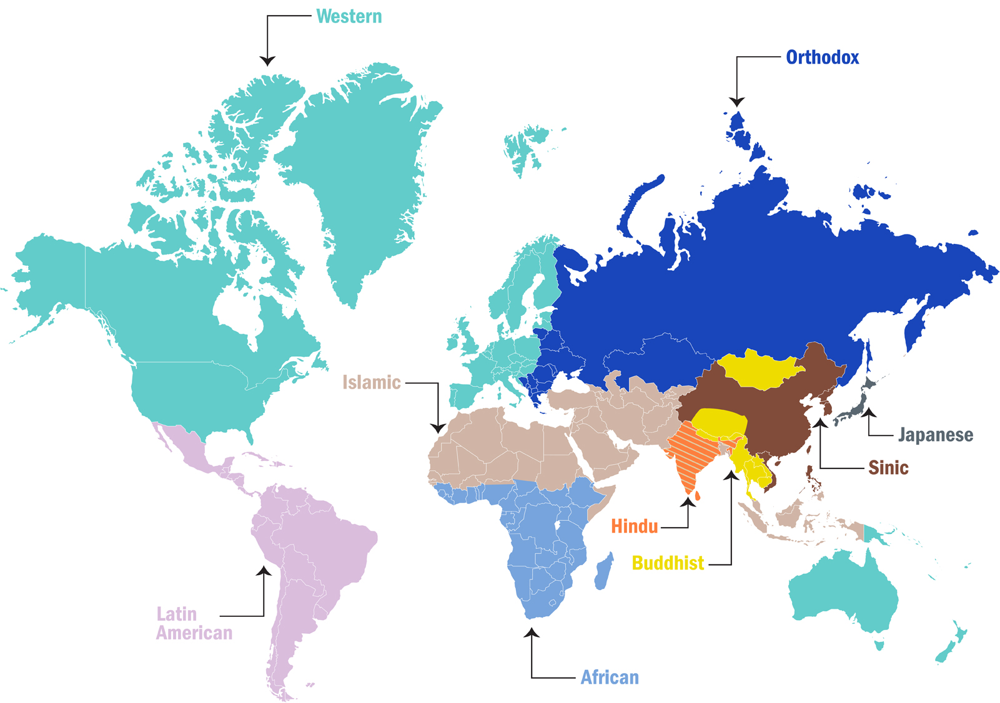

# Nation & Civilization

When it comes to big questions, perhaps none is bigger than how we should organize our societies. As a quick glance at the world map suggests, the dominant paradigm today for organizing ourselves is the nation-state. While this model might appear obvious, it's hardly inevitable and in many senses suboptimal. How then might we rethink the nation-state? Here, history presents an alternative - the civilization-state.

 

The prototypical nation-state is inhabited by a relatively homogenous population. The ties of a common ethnicity and language provide a readymade foundation on which to establish a coherent collective identity. Once established, this collective identity allows institutions of governance, which leads to a sovereign state. The ethnolinguistic base of nationhood also provides a very clear method to demarcate others, and gives the ability to impose rigid borders. It is very easy to determine who is "us" vs "them" when we speak different languages or worship different gods.

 

The nation-state is foremost a European invention as it was a natural response to the particular course of events that shaped that continent's history. For much of the past thousand years, Europe has been characterized by an abundance of small states in close proximity constantly at war with each other. Faced with constant competition from jealous neighbors and rivals, it was expedient for the elites of small European states to consolidate their control through assertion of a common ethnolinguistic identity. By doing so, they could draw a clear distinction between themselves and rival states.

 

France and England are good examples of this. Even though the conquest of England by Normans from France in 1066 resulted in wholesale replacement of the native Saxon elite by their Norman counterparts, this connection ceased to mean much by the time of the Franco-English Hundred Years War in the 14th century. Both had cultivated a clear sense of ethnic/cultural identity that distinguished them from each other, consolidating the elites' control and creating a rivalry which lasted for centuries.

 

The unification of Germany, perhaps the most important event of the 19th century, is another example. Since the early Middle Ages, the Germanic lands of Central Europe were a patchwork of hundreds of small and obscure principalities and fiefdoms, shepherded by the largest Germanic powers Prussia and Austria. All of these states were loosely grouped together as the "Holy Roman Empire" which Voltaire famously quipped was "neither Holy, nor Roman, nor an Empire". This incoherent and ineffective confederation finally ended in 1806 after Napoleon's advance across Europe.

 

The experience of defeat by a united French nation caused a scattered Germanic people to express their own desire for German unification. This feeling erupted during the revolutions of 1848, which were eventually crushed by Prussia and Austria to protect their own influence. Nevertheless pan-Germanic sentiment remained strong and in 1871, Prussian Minister-President Otto von Bismarck channeled this sentiment to engineer the unification of Germany by provoking a war against France. The combination of ethnicity and language inevitably succeeded in creating a German nation, just as it had succeeded countless times before in Europe. For a small continent densely packed with rival states, it was a winning formula.

 

During the age of colonization, Europeans brought their concept of the nation-state to all the continents of the world. As a result, many of today's borders stem from colonial bureaucrats' attempts to organize peoples according to the European paradigm. However as history shows, this has largely been a failed experiment - Europe's borders haven't been a good match for the peoples of Asia and Africa.

 

Why did these borders fail? There's nothing obviously wrong about organizing a nation along ethnolinguistic lines. In fact, it would be my first answer if someone asked me how to organize a state. One explanation is that the Europeans didn't put too much thought into carefully drawing their borders. This is obviously true, but there is a deeper reason beyond shambolic execution which would have inevitably doomed such an enterprise: for much of the world, the paradigm of the ethnolinguistic nation-state just isn't applicable.

 

Let's focus on Asia, which is home to the majority of humanity. The vast geographical span of Asia has given rise to a different set of historical dynamics than those in Europe. Instead of a constellation of small states, Asia has been characterized by vast multiethnic empires with porous borders that allowed different civilizations to blend, giving rise to various syncretic traditions. This distinct geography and history give rise to a different paradigm of organization - the civilization-state.

 

The definition of what it means to be a civilization-state is inherently tied up with what it means to be a civilization, which is not an easy thing to define. The simplest definition is that a civilization is a large society with unique and complex culture and traditions. These typically come from an extensive body of literature, composed over hundreds and sometimes thousands of years. A civilization is usually formed when the culture and traditions are strong enough to bind a very large and possibly very diverse population together for long periods of time. A civilization-state is therefore a state which finds its coherence not from ethnicity or language, but from civilizational traditions and values.

 

This importance of considering civilizations was most famously advanced by Harvard political scientist Samuel Huntington in his controversial 1993 book <em>The Clash of Civilizations</em>. Huntington argued that the conflicts of the future would be fought not between ideologies like communism and capitalism, but between rival civilizations as had been the norm for most of history. Huntington identified nine global civilizations, of which Asia is home to five: the Sinic, Indic, Buddhist, Japanese, and Islamic. In his framework, no other continent is home to more than two, showing the special relevance of civilization-states to Asia. In contrast, Western Europe and its outposts such as North America and Australia all combine to form Western civilization while Russia and Eastern Europe form the sister Orthodox civilization.

 

China is often seen as the prototypical civilization-state, with its own unique millennia old traditions and culture which stem from the time Qin Shi Huangdi became the first emperor of a unified China in 221 BC. In fact, one can trace its culture back even further to the time of Confucius in the 6th century BC, whose philosophies of filial piety and societal harmony have remained the bedrock of China and many other East Asian societies like Vietnam for over two thousand years. It was these values that Lee Kuan Yew, the founder of Singapore and one of the most respected statesmen of the 20th century, referred to when he mentioned the role of "Asian values" in Singapore's incredible ascent from poverty.

 

India is perhaps even more of a civilizational-state. A bewilderingly diverse mosaic of hundreds of languages and ethnicities, India's existence is totally incompatible with the nation-state model. Many argue that India only exists as a coherent entity because the British forcefully united all its various peoples, but this can't explain why India didn't break apart after the British yoke was removed. This explanation also neglects the existence of the 565 princely states in British India that were never directly governed by the British and despite controlling ~40% of its land. Only after independence were these princely states fully integrated into the union of India by a native Indian government. If it was only the British and/or a collective resentment towards them holding India together, the country would have ceased to exist long ago. Hence, the coherence of Indian identity must have originated long before the British ever set foot on the Indian subcontinent.

 

Although India has been unified only a few times over the past 3000 years, the idea of an Indian civilizational space in the subcontinent has existed throughout history. The oldest Hindu religious texts reference the region bounded by the Himalaya and the Indian Ocean as <em>Bhāratavarṣa</em>. From this comes <em>Bhārat</em>, the name by which many Indians today address their own country. The idea of an Indian civilizational space was also echoed by the Greek writer Megasthenes in his work Indica around 300 BC. This vast space gained a coherent identity not because of the British or another external invading force, but because of a common internal set of traditions and values initially seeded by ancient scriptures, like the foundational belief in dharma. These traditions eventually gave rise to other schools of thought such as Buddhism, Jainism, and Sikhism which in turn spread Indic influence beyond the barriers of ethnicity and language to East, South East, and Central Asia.

 

In a curious twist of history, it appears that after exporting the nation-state to the world, now some Europeans would like to import the civilization-state. The European elite, through projects like the well-intentioned but comically clumsy European Union, has steadfastly tried to overcome the continent's ethnolinguistic divides. In its place, they seek to cultivate an identity based on the common European values stemming from the Enlightenment and the synthesis of Greco-Roman and Judaeo-Christian traditions. It's not hard to see why: in today's world, European nations are too small to command influence but together they could be a factor. This has become especially clear following the Russia-Ukraine war, where the West's surprisingly effective response has relied on European countries acting in unison. Much like India, Europe has a clearly defined civilizational space but has never been fully unified in its history. If this century truly will be marked by clashes between civilizations, maybe Europe must become a civilization-state to remain relevant.

 

Europe's offshoots, namely the US, Canada, and Australia, are already ahead of their European counterparts in this transition. None of these countries bases its identity on language or ethnicity but instead on common Western values such as individualism. This is what has allowed them to adapt to become successful and wealthy countries that are multicultural yet firmly rooted in Western civilization. In this respect, they provide a good blueprint that the Europeans might like to follow.

 

There are two basic ways of organizing societies. One is on the basis of ethnicity and language, which gives rise to the nation-state, which worked well in Europe's particular geographic and historical context. Another is on the basis of common values and traditions, which gives rise to the civilization-state, which worked in Asia's vast spaces. Of course, it's foolish to think that one is "better" than the other. Both are simply practical responses to the unique historical dynamics of the regions in which they emerged. The nation-state model helped Europe become the richest and most powerful continent for a time. Before that, the civilization-state model helped Asia do the same. In today's turbulent age, with the whole world seemingly a stage for geopolitical rivalry, we will no doubt see yet another contest between nation and civilization.

 