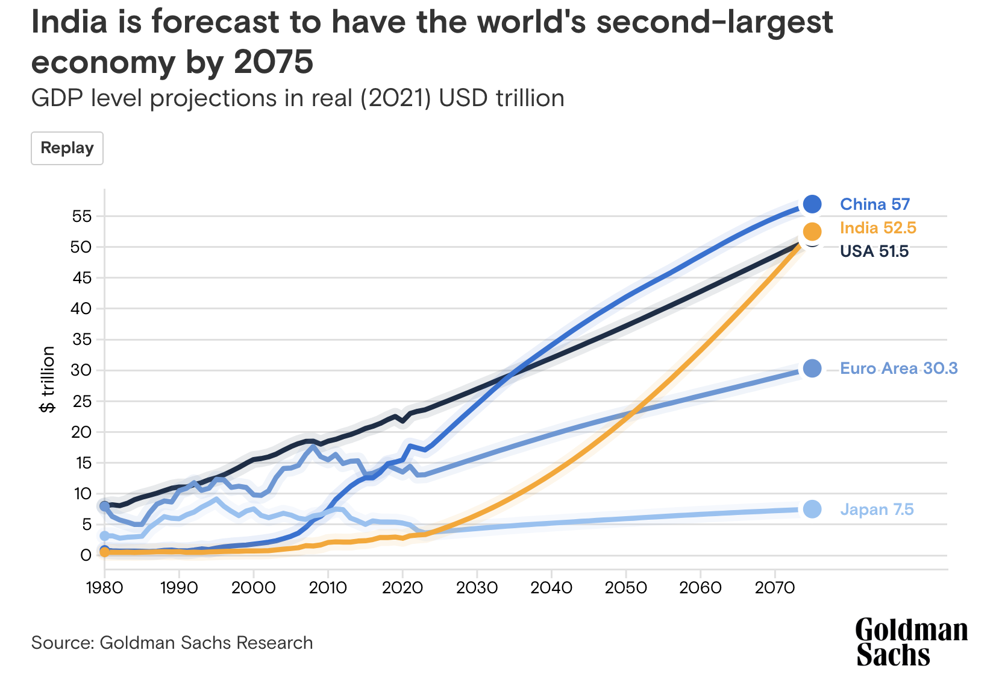

# Humility and Error Bars

If there’s one thing doing a PhD will teach you, it’s that you know very little. Even when you are supposedly an “expert” in whatever niche, you realise that no matter how much you know, there is always more that you don’t know. Sometimes, as quantum mechanics tells us, there are things that <a href="https://scienceexchange.caltech.edu/topics/quantum-science-explained/uncertainty-principle#:~:text=Formulated%20by%20the%20German%20physicist,about%20its%20speed%20and%20vice">you can’t ever know</a>. 

 

Of course this doesn’t apply only to those who earn their living at the uncharted frontiers of human knowledge. In any situation of sufficient complexity – i.e. any actually interesting situation with real world consequences – there are factors whose impact we can’t model no matter how hard we try.

 

Despite this, we are constantly inundated with confident predictions boasting comical levels of precision. So and so stock index will be at exactly so and so value to 3 decimal places next year. Country X will invade Y in exactly ten years, on and on. These predictions are rarely right and the vast majority of the time they are completely wrong. In general, they are useless. The level of confidence they claim is unjustifiable given the error introduced by higher order factors. As such, a modicum of introspection and  humility is in order.

 

Fortunately, there’s a simple solution which lets us admit our ignorance in a quantitatively rigorous fashion – just use error bars.

 

Any result in the natural sciences without a consideration of error would be laughed out of review. Why should this intellectually honest acknowledgement of our fundamental limitations be limited to the ivory tower of academia? 

 

As an example, take this recent <a href="https://www.goldmansachs.com/intelligence/pages/how-india-could-rise-to-the-worlds-second-biggest-economy.html">projection</a> from Goldman Sachs about world GDP in 2075. As an Indian, I would love nothing less for this graph to be 100% true. But more importantly as someone who values intellectual honesty, this chart is quite useless. 

 

The world today as it is virtually impossible to model, yet the geniuses at Goldman think they can precisely model global dynamics 50 years into the future and churn out GDP figures to the precision of one decimal place. Just think about all the disruption that has happened only in the past ten years that no one could have predicted, like covid and the rise of AI. Now imagine having the hubris to say I know how the world will evolve over 50 years and can predict GDP to a precision of 1%. Their (qualitative) discussion of broad macro factors is ok as a basis for claiming that India will get significantly richer, but certainly not enough to claim a value for GDP to percent level precision. 

 

Also notice how all of the lines are noisy before 2023, where there is real data, yet they become smooth and deterministic afterwards in the “projected” phase. Without error bars to account for all the noise in the projection period as well, this is a useless plot. The only thing I’d be willing to take from this is that India’s GDP may be $50 trillion within some O(1) factor by 2075.

 

Now instead imagine if we embraced the fundamental uncertainty in our measurements and predictions. Imagine a world where the CNBC pundit has the humility to say the S&P500 will be at 4700±200 next year. Where country X will invade Y in 10±5 years. Where your egg has 6±0.5g of protein. Where India’s GDP will be $50±10 trillion. My personal dream is a world where ESPN can say LeBron will average 26.1±3.7 ppg this year. Sure it’s not as crisp and attention grabbing as a definite sharp prediction, but it’s infinitely more useful. 

 

Uncertainty is a fundamental part of the world, and any claim that ignores this is a useless one. As <a href="https://www.chicagotribune.com/news/ct-xpm-1994-09-11-9409110413-story.html">Buffett</a> (± <a href="https://measuringu.com/approx-right/">some economist</a>) said, “it’s better to be approximately right rather than precisely wrong”. So, with humility, let’s smear out our useless sharp predictions and embrace uncertainty in all her messy glory. 

 
