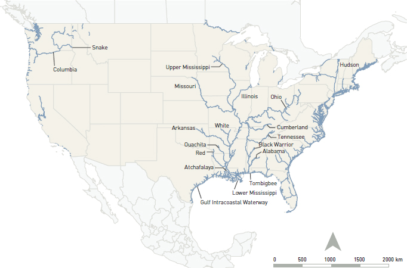
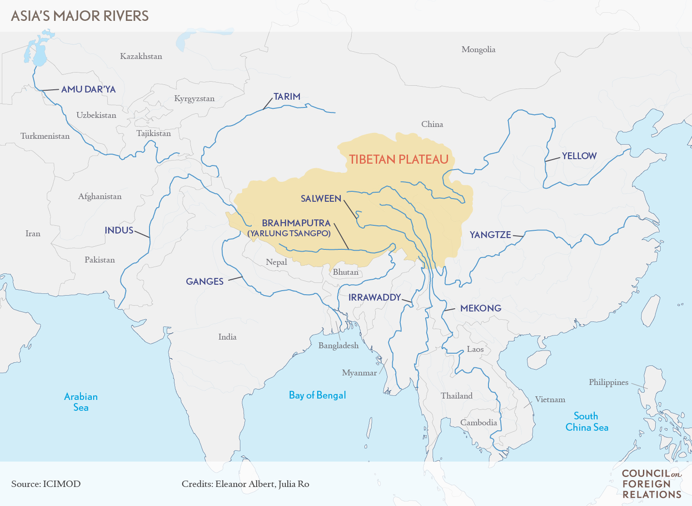
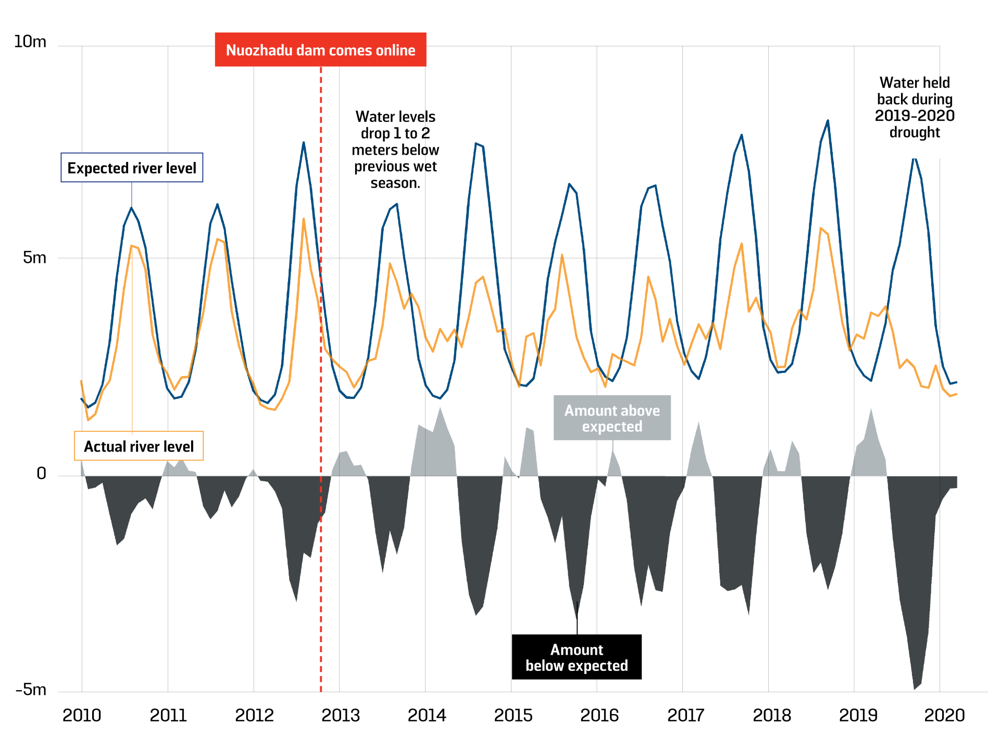

# Rivers: Catalysts for Prosperity & Geopolitical Weapons

Rivers do not typically come to mind when one considers what factors fuel economic prosperity. Instead, it is more common to prescribe a recipe including innovation, entrepreneurship and efficient bureaucracies backed by responsible governments. When one examines prosperous states throughout history, the ubiquity of this recipe becomes clear. However, another commonality becomes apparent -- the presence of rivers within their borders. Many great civilisations of antiquity coalesced first around prominent rivers, such as the Egyptians around the Nile c. 3000 BCE and the Akkadians around the Tigris & Euphrates c. 2000 BCE. Rivers such as the Danube and Rhine were undoubtedly a catalyst for Europe’s mercantilism, while the contemporary US enjoys the benefit of the Missouri and Mississippi.

 

Rivers lead to prosperity for a variety of reasons. An obvious one is that rivers catalyse agricultural activity. The Nile’s annual flood reinvigorated the soil on its banks and made it fertile. The fertility of the soil and the Nile’s predictable flooding pattern made agriculture so efficient that Egypt remained the breadbasket of the Mediterranean for three thousand years. A second vital factor is that navigable rivers greatly boost commercial activity. Navigable here means that a river is large enough to allow cargo carrying vessels to sail on it. The US has been blessed with more than 40,000 km of navigable rivers, and this has played a key role in US economic prosperity. US waterways ship around $70 billion worth of goods annually, worth more than the GDP of over 100 other nations.

 

{:.image-caption}
*
A map of the navigable rivers in the United States. Image from <a href="https://www.nap.edu/read/21763/chapter/4#16">Transportation Research Board.</a>
*

Furthermore, as climate change necessitates a shift to renewable energy, rivers take on extra value as sources of hydroelectric power. In 2015, hydroelectric represented 70% of total global renewable electricity and in 2019 China led the world with 356 GW of installed capacity, largely due to its control over the rivers of the Tibetan Plateau. Tibet also sources the Yellow and Yangtze Rivers, which have been vital to China’s status as a preeminent civilisation from antiquity to the present.

 

China’s control of the Tibetan Plateau, whose average elevation is around 4,500m, gives it remarkable hydroelectric potential as its most important rivers, the Yellow and Yangtze, are sourced here. In addition, Tibet -- called the “Water Tower of Asia” -- sources the Indus, Ganges, Brahmaputra, Mekong, and Irawaddy Rivers, which all provide water to over 1/5th of humanity
from Pakistan to Vietnam.

 

{:.image-caption}
*
A map of the major rivers of the Tibetan Plateau. Image from <a href="https://www.cfr.org/backgrounder/water-clouds-tibetan-plateau">Council on Foreign Relations.</a>
*

At present, China is engaged in a vigorous campaign of building dams, having constructed almost 90,000 over the past seventy years, at the cost of millions of internally displaced. This campaign is a key pillar in achieving Chinese energy independence. As I have analysed elsewhere, China’s reliance on energy from the Middle East makes it vulnerable as ~80% of its energy comes through the Strait of Malacca. This Malacca Dilemma leaves it vulnerable to events in the Indian Ocean. It also does not help that the most powerful naval presence in the Indian Ocean belongs to the United States, with which China has an increasingly hostile relationship. Expediting its hydropower projects gives China an opportunity to decouple from energy that must travel through the Indian Ocean and establish a degree of independence.

 

In addition to hydropower, irrigation is another key aspect of the Chinese plan for Tibet’s rivers. Irrigated agriculture is one of the major users of Tibetan water resources, and almost 40% of Tibetan land is under irrigation. The extensive damming and irrigation infrastructure in Tibet amounts to a significant use of water that will have strong impacts on countries downstream in South and Southeast Asia.

 

One immediate impact will be a reduced rate of water flow downstream. There are claims that China’s dams on the Brahmaputra have had a very real impact on downstream flows. Beijing is quick to rebuff such claims, arguing that its dams are Run-of-River (ROR) dams that simply divert a portion of the river to go past hydroelectric turbines before rerouting it back. ROR projects however, are not as benign as suggested since they require storing water during the day and releasing it all at night during peak demand hours in a pattern that interferes with the river’s flow. Dams have also been linked with higher probabilities of earthquakes. Peter Bosshard, of the NGO International Rivers, has pointed out that “Blocking the Yarlung Tsangpo … would withhold the river’s sediments from the fertile floodplains of Assam in north-east India, and Bangladesh” in addition to devastating the Tibetan plateau’s ecosystem.

 

In Southeast Asia, the Mekong has begun to also behave erratically. Like the Nile, the Mekong also has an annual cycle of rising and lowering water levels. In July 2019 however, Thailand had to mobilise its army in response to a drought linked to the Mekong’s abnormally low water level. Such behaviour has become increasingly common following extensive upstream dam construction.

 

The Nuozhadu Dam is 5.8 GW capacity dam on the Mekong in Yunnan province in southwest China. The fourth tallest dam in China, its appearance has an undeniable correlation with the greater instability of the Mekong’s water levels. As the Mekong becomes more erratic, it will begin to harm more communities and livelihoods downstream.

 

{:.image-caption}
*
Plot of the variation in the Mekong River water level before and after Nuozhadu Dam. Image from <a href="https://foreignpolicy.com/2020/04/22/science-shows-chinese-dams-devastating-mekong-river/">Regan Kwan, Stimson Center via Foreign Policy.</a>
*

Control of upstream resources thus provides vital leverage to China over downstream countries. Most, such as the southeast Asian states that depend on the Mekong, must unfortunately watch helplessly as they are not in a position to challenge China directly. The decline of international institutions that may have helped in posing such a challenge to Chinese hydro engineering further amplifies their lack of options. The only regional player which could challenge China to some extent is India. One option available to India is to leverage its relationship with water rich Bhutan, Myanmar, and Nepal to tap into their hydropower reserves. Hydroelectric exports to India have been an important source of Bhutan’s growth, and it is also very much in India’s interest to cultivate close relationships with its neighbours who are also the targets of Chinese overtures. In addition, it will also allow India to seize the initiative in countries such as Nepal which contain the upstream sections of many Indian rivers, thus mitigating water security issues. India is particularly vulnerable to China’s control of the upstream Himalayan rivers since it receives nearly half of all river water that leaves Chinese territory. Given this, New Delhi must be assertive in the sphere of hydro-diplomacy and make it clear to Beijing that it will not simply abide by Chinese designs for the region. The disengagement of the United States from world affairs is a disadvantage for India as Washington’s support could have significantly bolstered New Delhi. The reality remains that India is not in a position to directly challenge China on this issue due to a decisive geographic disadvantage, but it must act so as to not allow Beijing to unilaterally seize the initiative on water.

 

Rivers have been vital for the flourishing of civilisations from Ancient Egypt to the modern era. They played a key role in the United States’ unprecedented economic development, much as they are in contemporary China. Beijing’s control of Tibet gives it vital upstream control of Himalayan rivers such as the Brahmaputra and Mekong and thus incredible leverage over downstream states. India is in a position to mitigate the impact of Chinese actions in Tibet and challenge them to some degree. Without the help of multilateral institutions however, whose influence has rapidly declined in recent years, it is difficult for India or any other power to pose a significant hindrance to Chinese hydroelectric designs.

