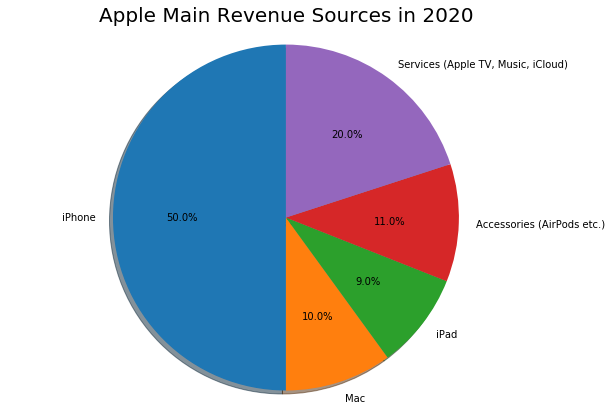
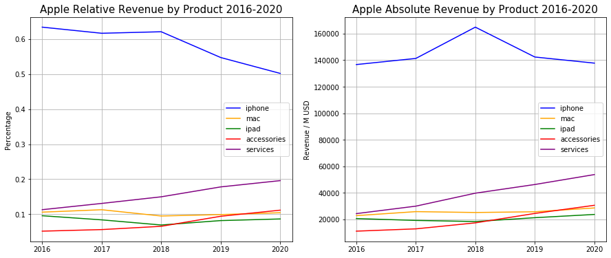
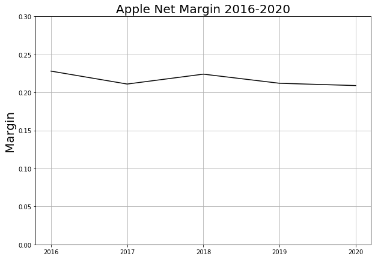
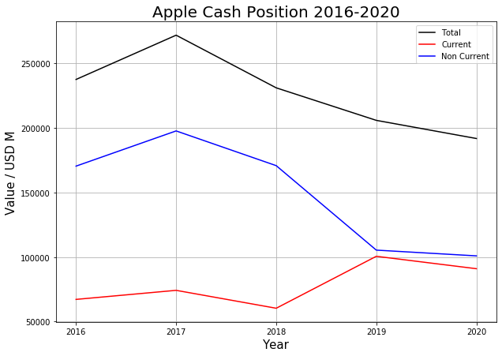
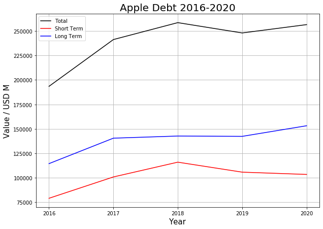

# Apple

I’ve recently taken the plunge into the murky waters of the stock market. One of the first companies that I wanted to look at as a serious investment was Apple. Apple initially caught my eye since I realised I am an exceptionally loyal customer of theirs and I figured if I could invest so much into their phones and computers, I should definitely take a look at their stock. There were two other reasons I wanted to look at Apple as the potential first entrant in my portfolio. Firstly, Apple is the largest company in the world overflowing with cash and unlikely to fail, and at the same time it is one of the biggest players in the dynamic technology sector. Combining these two, it seems like Apple would be a nice moderate blend of risk and reward for a meager graduate student. Here, I attempt to piece together a story for where I think the company is heading and translate that into a concrete valuation.

 

<ol type="1">
<li><a href="#shortstory">The Short Story</a></li>
<li><a href="#wheremoney">Where Does the Money Come From?</a></li>
<li><a href="#monay">Show Me The Money: A Dive into the Balance Sheet</a></li>
</ol>

## The Short Story

As of this writing (Dec. 2020), Apple sits snugly on a $2T market valuation, making it the largest company in the world. It had what could be called the most innovative period for a company with its iPod, iPhone, and iPad launch. The iPhone in particular was a major disruptive force that changed the market and brought the term smartphone into the mainstream. This amazing innovation is what led Apple to its stellar current valuation.

 

Today, however, Apple is a different company. It has transitioned from a disruptor to a more mature company in a steady state. Ever since the iPad launched in 2012, the company has not released any new product with the same disruptive capability of the iPod, iPad, and iPhone. Its business model focuses primarily on releasing new upgraded versions of these and the Mac annually and rely on its superior brand power to keep and attract new customers.  In recent years, however, it has tried to innovate with new operations in accessories - like Apple Watch - and services like Apple Music. Apple saw robust results even through covid, breaking revenue records in multiple quarters. This suggests that the core of its business is still as strong as ever.

 

## Where Does the Money Come From?

Let’s start our deeper look with a breakdown of Apple’s revenue by its products. Looking at Apple’s 2020 10-K, we see that its five primary segments are: iPhone, Mac, iPad, Accessories, and Services. Looking at their contributions to total revenue, we see that the iPhone is by far the most important product for Apple, accounting for half
its revenue.

{:.image-caption}
*
Apple revenue by segment.
*

Interestingly, iPad and Mac sales are the two smallest components of the pie coming in at 9 and 10% respectively. They are overtaken by the services and accessories segment. Services includes things such as App Store sales, iCloud storage, and Apple’s new services suite it has launched which I will address more later. The accessories sector includes products such as AirPods, Apple Watch, and Beats headphones.

 

One advantage of analysing a mature company is that there is plenty of history to base a first guess on where the company might be headed. The two plots below show the evolution of how different products have contributed to Apple’s revenues. The left shows what percentage of revenue each sector contributes while the right chart shows how much money each sector brings in on absolute terms. The first big thing to note here is that although iPhones form the largest slice of the Apple pie, they are slowly shrinking in relative importance. In 2016, the iPhone was above 60% of revenues and it has come down to 50% over 5 years, a decline of about 2% per year.

{:.image-caption}
*
Apple revenue by segment from 2016-2020 in relative and absolute terms.
*

On the left plot, we see that the amount of money the iPhone brings hasn’t actually changed that much over this period, which means that the decline in relative size must be because other sectors are getting larger and not because the iPhone is itself making less money. This is a good sign, since it shows Apple is trying new things while its old reliable workhorse is still performing consistently. It’s experimenting from a secure location and can afford to fail. The iPhone is a mature product and is not going to disrupt any market. In recent years, the extent of modifications to the iPhone include 5G capability, ever more powerful cameras, and larger screens. Important, but not revolutionary updates. Moreover, Apple faces <a href="https://www.statista.com/statistics/271496/global-market-share-held-by-smartphone-vendors-since-4th-quarter-2009/">stiff competition in the smartphone market</a> so margins have likely reached a stable equilibrium or will decline due to competition. Given this, I expect the iPhone to continue its 1-2% revenue growth rate for the foreseeable future.

 

The Mac and iPad sectors have been consistently less important to the Apple story. Mac has hovered around 10% of revenues and iPad slightly less. These also seem to have reached a stability since there has not been any major disruptive development with these products. These products don’t bring in such huge revenue as the iPhone, so the scope is there for slightly higher growth. I see their revenues continue to grow at past rates of 3-5%.

 

The real wild card here will be the services and accessories divisions. Let’s address services first since it’s the second largest chunk of the pie. The 10-K breaks services down into 5 sections: advertising, AppleCare, iCloud, digital content, and payments. The picture below shows the breakdown of services by revenue.

{:.image-caption}
*
Apple services revenue breakdown.
*

Advertising notably includes the huge licensing fees that Apple gets from Google to be its default search engine, around <a href="https://www.cnbc.com/2020/10/21/apple-services-success-story-bolstered-by-huge-google-payments.html">$8-12 billion</a>, meaning that more than 10% of Apple’s services revenue comes from a single customer. Antitrust regulators have also begun to investigate Google’s payments to Apple as an unfair tactic to suppress competition, making this a potential risk factor.

 

AppleCare refers to the fee-based support and service products for its hardware products.  iCloud enables users to store their files in the cloud for easy access across their phone/tablet/computer, a nice way to synchronise the Apple ecosystem. Payments includes Apple Pay and Apple Card and digital content includes platforms like Apple TV+, Apple Music, and Apple News+.

 

AppleCare, advertising, and iCloud are fundamentally linked to Apple’s hardware so I do not see any new disruptions emerging here which can change the story significantly. Payments could grow significantly depending on execution, but there is <a href="https://qz.com/1799912/apple-pay-on-pace-to-account-for-10-percent-of-global-card-transactions/#:~:text=Note%3A,field%20communication%20(NFC)%20tech.">definitely potential</a> here. To be conservative however, I will assume nothing major will happen here.

 

I want to focus more on the digital content, since in my opinion this holds a significant place in the services story. The App Store will continue to generate money as it has, but the newer additions of Apple Music, TV+, Arcade and News+ are bigger unknowns.

 

Of the actual new services, I am not particularly confident in News+ and Arcade. News+ is a service that curates news articles for readers. Readers pay a subscription fee and publishers also pay to have their work on the platform. There are some prominent publications such as WSJ there. Although missing from the service is America’s largest newspaper the New York Times. News+ had a very fast launch with 200,000 subscribers but hasn’t budged much beyond that. They’ve also stopped saying how many people are subscribed to News+ which isn’t a good sign. I also can't see any incentive to pay for a news curation service with news so easily accessible on the internet these days. Arcade has potential but seems to have been executed a bit poorly as people can’t distinguish between it and games on the App Store.

 

The remaining services Music and TV+ have made more waves since their launch but also have a tough path. TV+ has potential but hasn't had a star show yet to really popularise it. It currently faces stiff competition from Netflix (30% of the streaming market), Amazon Prime Video (25%) and Hulu (15%). TV+ is nowhere near large enough currently and isn't disruptive enough to cause a shift unless it gets a blockbuster TV series of its own to attract customers. I think TV+ will grow as a result of users already in the Apple ecosystem trickling in rather than of its own merit. I am more optimistic on Music since Apple Music has a huge collection and is the second largest player in the music streaming market behind Spotify.

 

Overall, I am not as optimistic on services as others. It will generate good revenues but I don't think it will be impactful enough to really shift the focus of the Apple story from hardware. Even now the largest components of services are directly linked to hardware, and the new services launched seemed to be aimed more at those in the Apple ecosystem rather than universal applicability e.g. with Netflix being available on all platforms. I'm going to say on a whole services will grow at 10-15% simply because it's new, down from the 17% CAGR from 2016-2020. A
<a href="https://www.forbes.com/sites/greatspeculations/2020/02/25/apples-services-to-top-50-billion-profits-by-2025--beating-iphone/?sh=1481d2d653db">Forbes’ analysis</a> forecasts services growing from 46.0B in 2019 to 89.5B in 2025, a CAGR of 11%, in line with my estimate.

 

Accessories, which has overtaken Mac and iPad, includes products like AirPods and Apple Watch. Historically it’s grown the fastest of the segments at 22%. One negative factor here is that Apple accessories are primarily designed to talk to existing Apple hardware. For instance Apple Watches do not easily communicate with Android phones. This makes it harder to bring new customers in. Other examples of this include the MagSafe charger that works with new iPhones. The Apple MagSafe wallet protects credit cards from the magnetic fields that the new iPhones emit to allow them to use MagSafe chargers. As with services, accessories seems to be tied more to catering to customers already in the Apple ecosystem rather than bringing new customers in. For this reason I would think the growth should taper a little as Apple exhausts its existing base of hardware customers and average closer to 15% for the near to long term.

 

Turning to profitability, we see that Apple’s net margins have been on a very slight decline for the majority of the past decade, but they have remained above 20%. Operating margins show a similar very slight decline also. This supports the view

 

{:.image-caption}
*
Apple net margin 2016-2020.
*

that Apple has reached a sort of a steady state stage of its life cycle. For this reason, I will assume that net margins remain at 20% with no significant deviation.

 

## Show Me The Money: A Dive into the Balance Sheet

Let’s take a brief glimpse at Apple’s balance sheet. Since it’s such a huge company we would guess it is under no immediate risk of failure. Obviously the most important thing to note is how Apple is sitting on a colossal $191.8 billion in cash. Of this, $90B comes under the current assets category. Of course, cash just sitting in the vault is a good safety blanket but it might be wasteful to not do anything with it and let it sit there. Let’s see how Apple’s cash position has evolved over time.

 

{:.image-caption}
*
Apple cash position 2016-2020.
*

We see that Apple has been shedding cash, mostly on stock buybacks which have pushed its debt to equity ratio up. Nevertheless Apple still has nearly $200B in cash which is incredible and larger than the GDP of a lot of countries.
  
On the debt front things look stable. Both short term and long term debt seem to have flattened. One
nice sign is that Apple’s cash of ~200B excluding other assets  is already a fair amount of its total liabilities. This means the company is secure with a current ratio around 0.8. This isn’t telling us anything new, just confirming what we suspected when we said Apple is the largest company in the world and a cash machine.

 

{:.image-caption}
*
Apple cash position 2016-2020.
*

## Valuation & Investment Strategy

The above translates into an expected net earnings growth uniformly distributed between 5 and 10%, buoyed mainly by the new services and accessories division. I will use Apple’s weighted average cost of capital (WACC) of 8.04% as reported by GuruFocus to do a discounted cash flow (DCF) analysis based on Apple’s free cash flow, which I define as:

 

The quantities here are the earnings before interest and tax (EBIT) adjusted for taxes, depreciation, capital
expenditures, and change in working capital.
I took the 5 year average of capex since this tends to be a “lumpy” quantity and one time huge capital expenditures could penalise the FCF value unfairly. In the actual valuation I will play with the FCF in two ways to incorporate debt. In the first, I did a DCF analysis using just the FCF described above and then at the end add back (cash - long term debt) to adjust for debt (I assume short
term debt is not a huge problem over the long term). In the second, I will adjust the FCF by adding the net change in long term debt. In this, debt payments reflect a negative cash flow while debt incurred reflects an effective positive cash flow in. The first method is how I initially thought the debt should be incorporated, and the second is
Prof. Aswath Damodaran’s (aka the Dean of Valuation) free cash flow to equity (FCFE) method. Moreover, since $100B of Apple's cash is
in non-current marketable securities, these are not immediately liquid so I will assume only half of these can be liquidated on a
sensible timescale in emergencies. This gives a still very impressive cash balance of $141B.
  
With the above, I did a simple Monte Carlo simulation with 10,000 trials of different growth rates for both methods. The results are below

{:.image-caption}
*
DCF Valuations of Apple stock based on FCF with a manual correction for debt at the end and FCFE method.
*

Reassuringly, both sets of simulations center around similar average values of $73 and $76, with a fair amount of overlap between 70-82. This suggests that with my growth assumptions, Apple is currently very overvalued (at 123.75 after close on 7/12/20).

Based on this, and the fact that whatever little money I have in my bank account is very dear to me, I would definitely buy in bulk  below 70, probably buy between 70 and 80, maybe hop onto the bandwagon around 85, and probably leave it alone much more than that.
However, since Apple is a quality company, my personal strategy will be to buy only 1 or 2 shares to at least get into the
market - assuming time in the market trumps timing the market in the long term. However, if Apple undergoes a precipitous drop,
I will go for a bigger position.  
