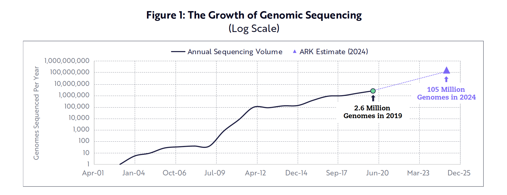

# The Genetics Revolution

The post Covid world is a time of great technological change and disruption. One of the
main agents of this disruption could be exciting developments in the genetics space that could
really change medicine and healthcare. This trend will create some
exciting investment opportunities.

 

Before you can do anything exciting with DNA, you must be able to read it to see what it is telling you. Reading it means determining the sequence of biological base pairs that code the information in DNA. The first important development has been the sharp reduction of price in sequencing genomes. The figure below shows this trend very clearly. The Human Genome Project, which ran from 1990-2003, cost more than $1B to sequence a handful of human genomes. Today, a genome can be sequenced for closer to $1000.

{:.image-caption}
*
The Decline in Genetic Sequencing, from NIH.
*

The decline in sequencing has been very rapid, and has in fact beaten Moore’s Law since 2008. Moore’s law was first used in hi-tech electronics and said that the computational power doubles every two years. The genetics equivalent would be that the cost to sequence halves every two years, and the plot above shows that DNA sequencing is actually beating Moore’s law. Just as hi-tech transistors eventually became common in all sorts of devices as they followed Moore’s law, so too we could guess that genetic sequencing would become more common as prices drop. This lowering of cost is the critical development that will allow commercial genomics as it will allow regular people at regular clinics to take advantage of sequencing. ARK Invest predicts that the number of genomes sequenced could expand greatly as a result of lower costs from millions to around 100 million by 2024.

{:.image-caption}
*
Projected Growth in Genetic Sequencing, from ARK Invest.
*

Genetics is also benefiting from the numerous leaps in machine learning and artificial intelligence research in recent years. These have allowed researchers to develop more effective algorithms to analyse the vast quantities of new genomic data now available cheaply. With this, we can identify illnesses with pinpoint accuracy or analyse protein molecules more easily to develop new medicines. Google’s <a href="https://deepmind.com/blog/article/alphafold-a-solution-to-a-50-year-old-grand-challenge-in-biology">
DeepMind recently released AlphaFold2</a>, an AI algorithm that can predict protein shapes based on genetic data. This could be huge in drug discovery. A growing ability to process genetic information can also help to generate new therapies. Together with lower sequencing costs, this creates a virtuous cycle. Lower sequencing cost means more genetic data is available to train better algorithms. These will create better diagnostic and therapeutic results, which
should encourage more ordinary people to consider genetic analysis, which will then expand the pool of genetic data to develop new insights and so on.

{:.image-caption}
*
Example of AlphaFold2 Predicting Protein Shape, from DeepMind.
*

Greater access to cheaper screening means tremendous opportunities for consumers. DNA can be sequenced to more accurately identify risk factors for diseases such as cancers and inherited disorders that are typically discovered only when it is too late. Furthermore, concurrent developments in areas such as machine learning will allow caregivers to develop more accurate diagnostic models. Some examples of concrete applications would include germline assessment and liquid biopsies. Germline assessment involves studying the genomes from reproductive cells to determine what hereditary diseases you could transmit. Liquid biopsy involves studying DNA that cancerous cells release into the blood to understand it better and therefore decide on the best possible course of therapy. Another huge possibility is the use of <a href="https://www.livescience.com/58790-crispr-explained.html#:~:text=CRISPR%20technology%20is%20a%20simple,of%20diseases%20and%20improving%20crops">CRISPR technology</a>, which could provide <a href="https://www.healthline.com/health-news/first-person-treated-for-sickle-cell-disease-with-crispr-is-doing-well">permanent <em>in vivo</em> cures to genetic diseases such as sickle-cell anaemia</a>. The possibility for personalised medicine tailored to an individual’s personal genetic makeup could change healthcare and it is estimated that <a href="https://www.mckinsey.com/industries/pharmaceuticals-and-medical-products/our-insights/genetic-testing-opportunities-to-unlock-value-in-precision-medicine">revenues could triple to  over $100B by 2026</a>.

 

Overall, genetics is at a point where it can leverage advancements in gene sequencing and artificial intelligence to have a huge commercial impact. When you add the possibilities of new genetics techniques such as CRISPR, which could do things medicine currently cannot, such as cure genetic diseases, you get a package that could really disrupt medicine as a whole.

 

Although this is an immensely exciting opportunity, I’m afraid I don’t feel confident enough to bet on individual companies in this sector. I consider basic science in my circle of competence, but this is a rapidly innovating field and my genetics knowledge isn’t adequate to determine whether company X’s single molecule sequencing will win over company Y’s nanopore technology. I know enough basic genetics however, to confirm the exciting potential here. For that reason I will be on the lookout for any ETFs that capture a broad slice of this exciting new market, such as ARK Invest’s ARKG.  

