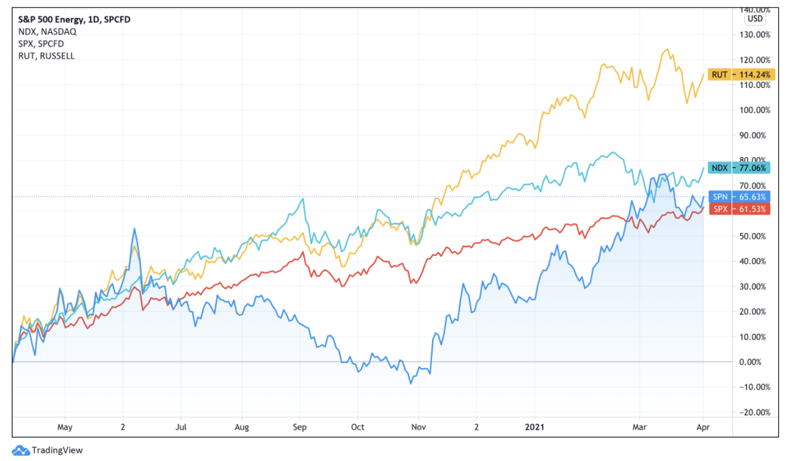
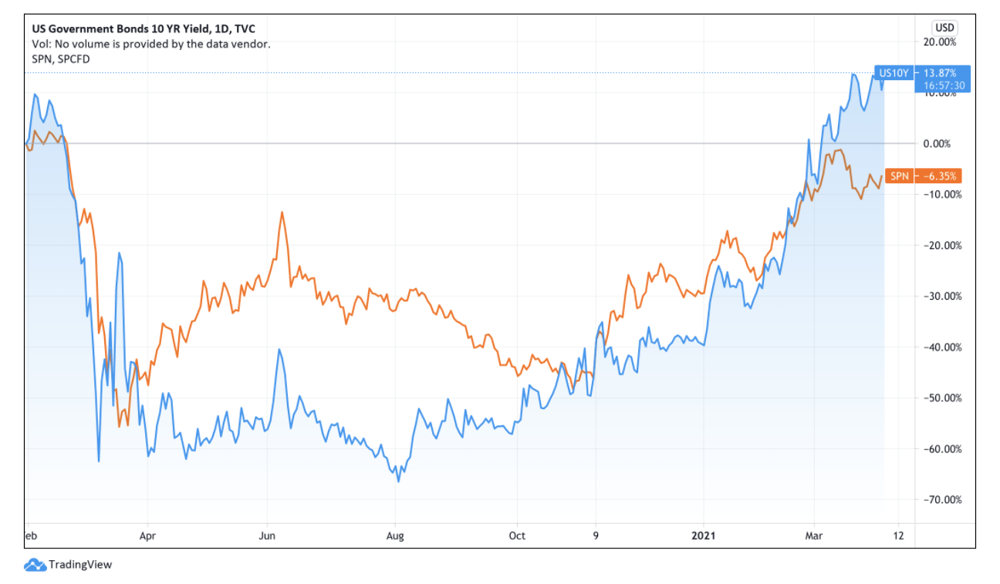
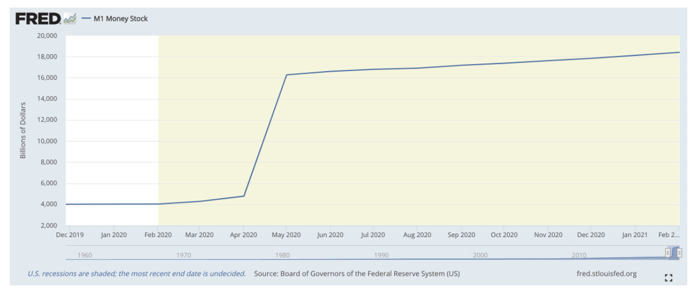
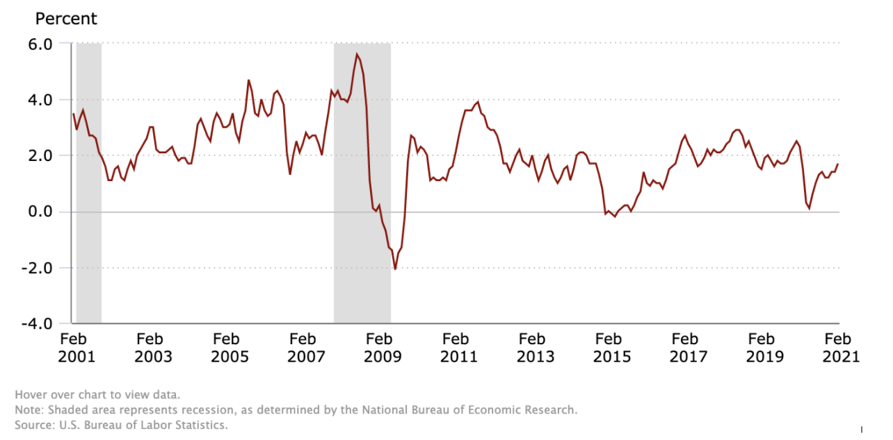

# Stocks in an Inflationary Environment

One of the most notable economic consequences of the pandemic last year was the steep drop in interest rates. Terrified by the prospect of a total meltdown, the Federal Reserve adopted a “whatever it takes” stance to ensure liquidity in the market. As rates dropped and liquidity poured in, 2020 turned out to be a blockbuster year for markets. After the initial crash, the S&P 500 has rebounded with a stellar 74% rise from the March 2020 lows. The tech heavy NASDAQ and small cap Russell 2000 indices were even more impressive, rising by over 100% each from their lows. 2020 was a great year for stocks, but it was a tremendous year for tech and growth in particular.

 

Recently, however, there has been a reversal in the markets. In early 2021, it has been energy and not tech which has been the best performing sector. Just last year, energy appeared to be on life support with crude prices dropping negative at one point. Yet despite this, as the chart below
clearly shows, energy has roared back.

{:.image-caption}
*
YTD performance of energy stocks - represented by S&P 500 Energy Index (SPN) - vs S&P 500 (SPX), NASDAQ 100 (NDX), and Russell 2000 (RUT). Source: TradingView.
*

This chart compares the year-to-date performance of the S&P Energy index SPN with the three indices mentioned above. For much of 2020, energy severely underperformed the market. This made sense given the depressed demand for energy due to pandemic lockdowns. Yet from about November, energy has an almost phoenix-like ascent from the ashes. By April 2021, energy’s quarterly return had matched the S&P 500 and NASDAQ’s yearly return. Energy has not surpassed the Russell 2000 yet but at this rate that could be a possibility soon. What’s happening here?

 

A large part of the answer lies in what’s happening in the bond markets. Let’s overlay SPN with the yield on the US 10 Year Government Bond, considered the benchmark risk free rate of return in the economy. We see that initially as the crisis hit, bond yields plunged thanks to the Federal Reserve’s actions. For much of 2020, bond yields remained low. Near the end of the year, however, yields began to rise. By early 2021, yields were in an accelerated ascent. Energy seems to be tracing the same path as interest rates. Rising interest rates go hand in hand with the energy sector’s performance.

{:.image-caption}
*
YTD comparison of SPN vs US 10Y Treasury Note Yield. Source: TradingView.
*

The crucial factor behind rising interest rates and returns on energy stocks is inflation. First let’s address the link between inflation and interest rates. As a result of its economic response to the pandemic, the US has injected huge amounts of money into its economy. The graph below shows the (M1) money supply in the US, with the shaded part marking the COVID recession. As a result of the Federal Reserve’s actions to shore up the economy, the money supply expanded by more than 3x from ~$5 trillion to ~$16 trillion. Milton Friedman famously said that “Inflation is always and everywhere a monetary phenomenon in the sense that it is and can be produced only by a more rapid increase in the quantity of money than in output”.  Given this, it is to be expected that such a huge expansion of the money supply in such a short amount of time could create strong inflationary pressures.

{:.image-caption}
*
US M1 supply from Dec. 2019 to Feb 2021. Source: Board of Governors of the Federal Reserve System (US).
*

n addition to expansive monetary actions, the US government has engaged in aggressive fiscal policy to stabilise the economy. The 2020 CARES Act injected 2.2 trillion dollars of fiscal stimulus. Another $900B in COVID stimulus - in addition to $1.4 trillion of government spending - was provided by the Consolidated Appropriations Act passed in late 2020. President Biden’s American Rescue Plan Act in early 2021 supplied another $1.9 trillion of fiscal stimulus, and the Biden administration has already unveiled a $3 trillion infrastructure bill. Overall, $8 trillion of fiscal stimulus has been supplied in one year alone. For perspective, the Marshall Plan which reconstructed Western Europe after WWII would be worth about $100-200 billion today, adjusted for inflation. US GDP today sits at about $20 trillion. The sheer size of the fiscal and monetary action undertaken does leave one amazed.

 

Some commentators have drawn uncomfortable parallels with the imprudent monetary policy of the German Reichsbank following World War I and the disastrous Weimar hyperinflation that followed. Looking at the chart of the Consumer Price Index however, which is the standard measure of inflation, suggests that although inflation is on the rise, it is not anywhere near the Weimar levels of thousands of percentage points.  

{:.image-caption}
*
Consumer Price Index from Feb 2001 to Feb 2021. Source: U.S. Bureau of Labor Statistics.
*

Nevertheless, the prospect of inflation is heavily weighing on the bond markets. Inflation erodes the value of debts and is a creditor’s nightmare. Given the prospects of inflation due to the expansive monetary and fiscal actions in 2020, US government debt has become less attractive. As US debt becomes less attractive, bond prices drop and yields rise. In the past three months alone there has been a steep ascent of around 700 basis points in the US 10 year yield.

 

The link between inflation and energy is more straightforward. Energy companies clearly stand to benefit from rising prices. Energy is an essential commodity and it is not so easy to switch from one supplier to another. As a result, energy companies can afford to pass on increased costs to their customers. Therefore, in an inflationary environment, energy companies won’t be at too much risk. Add the prospect of an economy ready to reopen and the accompanying increasing demand, and we see that energy stocks have generated outsized returns over the past few months as markets price in the prospects of economic growth and inflationary pressures.

 

Contrast this with tech stocks, and especially growth stocks. Tech companies, except for perhaps the biggest names, are more vulnerable to inflation. If prices rise enough, it could impact their revenues as tech products are not as essential as energy beyond a point. For growth companies, there is a double impact. They will be especially vulnerable to rising prices since their products are new and don’t have anywhere near the importance of an Apple MacBook or Android phone for example. Secondly, rising interest rates caused by fears of inflation mean that it will become harder for young companies to borrow money, which is crucial for an expanding company. Due to this, the value of future cash flows these companies may generate, which is central to growth stocks, will have to be discounted by a higher risk free rate. This will tend to reduce the sky high valuations we have seen for new tech/growth stocks in 2020. This is trend we have begun to see in early 2021.

 

Inflation, or more accurately fears of inflation, are therefore at the root of this transition in the stock market in early 2021. It remains to be seen whether these fears will be realised any time soon or whether other deflationary forces will act to balance the effects of expansionary monetary and fiscal policy. The Federal Reserve is clear that it does not intend to restrict liquidity until it determines that the economy is at full employment. It will be fascinating to observe the reactions of both the bond and stock markets as they juggle the dovish stance of the Fed with the prospects of inflation and growth.

 
